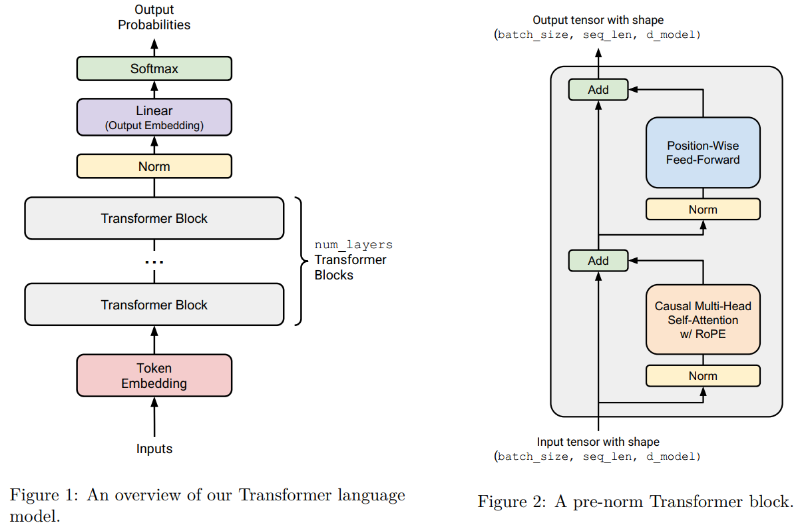
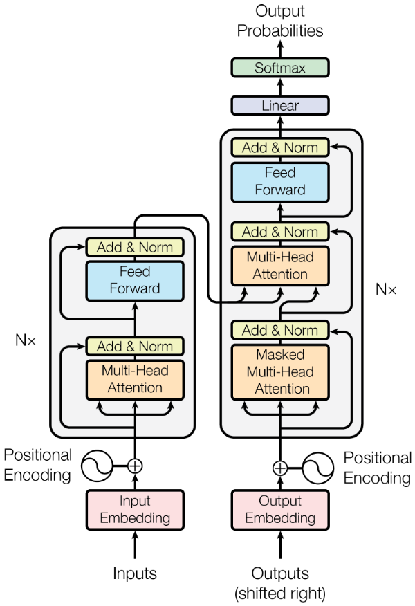
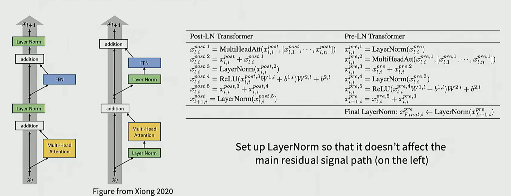
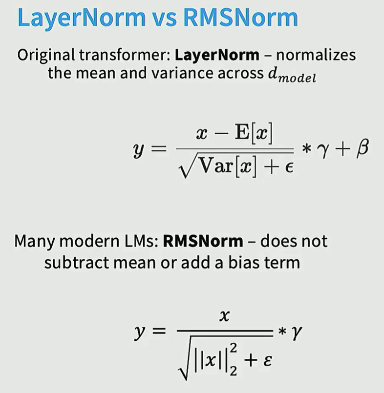
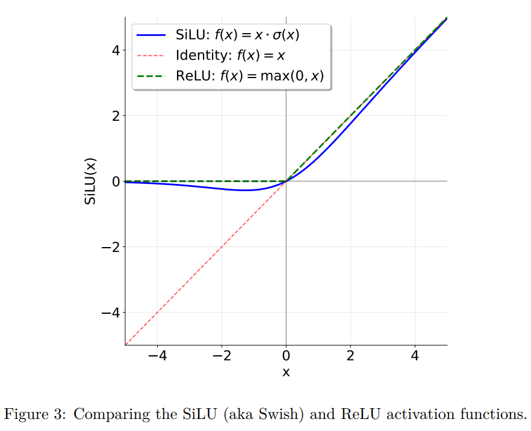
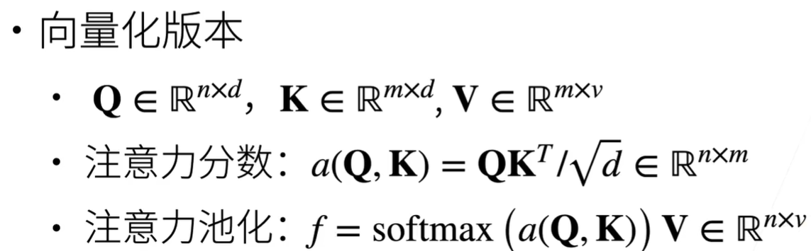

# Assignment 1 (basics): Building a Transformer LM

## 3 Transformer 语言模型架构
一个语言模型接收一批整数形式的标记ID序列作为输入（即，形状为 (batch_size, sequence_length) 的 torch.Tensor），并返回一个（批处理的）在词汇表上的归一化概率分布（即，形状为 (batch_size, sequence_length, vocab_size) 的 PyTorch Tensor），其中预测的分布是针对每个输入标记的下一个词。在训练语言模型时，我们使用这些对下一个词的预测，计算实际下一个词与预测下一个词之间的交叉熵损失。在推理阶段生成文本时，我们使用前馈网络最后一步（即序列中的最后一个时间步）预测的下一个词分布来生成序列中的下一个标记（例如，选择概率最高的标记，或从分布中采样等），将生成的标记添加到输入序列中，然后重复此过程。


在本作业的这一部分，你将从零开始构建这个Transformer语言模型。我们首先会给出模型的高级概述，然后再逐步详细介绍各个组成部分。

### 3.1 Transformer 语言模型
给定一个标记ID序列，Transformer语言模型首先使用输入嵌入（input embedding）将标记ID转换为稠密向量，然后将这些嵌入后的标记依次通过 num_layers 个 Transformer 块进行处理，最后应用一个可学习的线性投影（称为“输出嵌入”或“语言模型头”，即 LM head），生成预测的下一个标记的 logits。


#### 3.1.1 词元嵌入
在第一步中，Transformer 将（批处理的）标记ID序列嵌入为一系列向量，这些向量包含标记本身的信息（如图中的红色块所示）。
更具体地说，给定一个标记ID序列，Transformer 语言模型使用一个词元嵌入层（token embedding layer）生成一个向量序列。每个嵌入层接收一个形状为 (batch_size, sequence_length) 的整数张量，并输出一个形状为 (batch_size, sequence_length, d_model) 的向量序列。

#### 3.1.2 预归一化 Transformer 块
嵌入之后，激活值会经过多个结构相同的神经网络层进行处理。一个标准的 **decoder-only** Transformer 语言模型由 num_layers 个相同的层（通常称为 Transformer “块”）组成。
每个 Transformer 块接收一个形状为 (batch_size, sequence_length, d_model) 的输入，并输出一个相同形状的张量 (batch_size, sequence_length, d_model)。每个块通过自注意力机制在序列中聚合信息，并通过前馈网络层对其进行非线性变换。

### 3.2 输出归一化与嵌入
经过 num_layers 个 Transformer 块处理后，我们将获取最终的激活值，并将其转换为词汇表上的概率分布。

我们将实现“预归一化”（pre-norm）Transformer块（详见第3.5节），这种结构额外要求在最后一个Transformer块之后使用层归一化（Layer Normalization，详见下文），以确保输出具有适当的尺度。

在此归一化之后，我们将使用一个标准的可学习线性变换，将 Transformer 块的输出转换为预测的下一个标记的 logits，参见例如 Radford 等 [2018] 的公式2，如下所示:
$$
\mathrm{FFN}(x) = \max(0, xW_1 + b_1)\,W_2 + b_2.
$$

### 3.3 备注：批处理、Einsum 与高效计算
在整个 Transformer 模型中，我们会对许多类似批次的输入执行相同的计算。以下是一些例子：
- 批次中的元素：我们对每个批次中的样本都应用相同的 Transformer 前向操作。
- 序列长度：像 RMSNorm 和前馈网络这样的“逐位置”（position-wise）操作，在序列的每个位置上都以相同方式执行。
- 注意力头：在“多头注意力”机制中，注意力操作会在多个注意力头之间进行批处理。

因此，我们需要一种使用方便且高效的方式来执行这些操作，既能充分利用 GPU 的并行计算能力，又便于阅读和理解。许多 PyTorch 操作可以接受张量前端额外的“类批次”维度，并高效地在这些维度上重复或广播操作。

例如，假设我们要执行一个逐位置的批处理操作。我们有一个数据张量 D，其形状为 (batch_size, sequence_length, d_model)，并希望将其与一个形状为 (d_model, d_model) 的矩阵 A 进行批量向量-矩阵乘法。在这种情况下，D @ A 会自动执行批量矩阵乘法，这是 PyTorch 中一种高效的原语操作，其中 (batch_size, sequence_length) 维度被视为批处理维度。

正因为如此，最好假设你的函数可能会接收到额外的类批次维度，并始终将这些维度保留在 PyTorch 张量形状的最前面。为了组织张量以便能够以这种方式进行批处理，可能需要多次使用 view、reshape 和 transpose 操作来调整形状。这可能会比较繁琐，也常常导致代码难以阅读，且难以追踪张量的实际形状。

更便捷的选择是使用 torch.einsum 中的 einsum 记法，或采用框架无关的库如 einops 或 einx。两个核心操作是：
- **einsum**：可对任意维度的张量进行缩并（tensor contraction）；
- **rearrange**：可重新排列、拼接或分割张量维度。

事实上，机器学习中的大多数操作都可以归结为**维度变换**和**张量缩并**，外加偶尔的（通常是逐元素的）非线性函数。这意味着使用 einsum 记法可使代码更清晰、灵活。

我们强烈建议在课程中学习并使用 einsum 记法：

初学者请使用 einopshttps://einops.rocks/1-einops-basics/%EF%BC%9B
熟悉 einops 的同学可进一步学习更通用的 einx。

以下是一些使用 einsum 记法的示例，作为 einops 文档的补充。

```python
import torch
from einops import rearrange, einsum
```

计算张量 D（形状 [batch, seq, d_in]）和矩阵 A（形状 [d_out, d_in]）的乘积，结果应为 [batch, seq, d_out]。
1. **基础方法**：@ 运算符直接计算，需手动转置 A
2. **显式维度**：einops 第一种写法明确命名所有维度（如 batch seq d_in），可读性最佳
3. **省略号语法**：... d_in 自动匹配前置维度，适合高维张量（如后续的多头注意力案例）

验证部分通过 `torch.allclose` 确认所有方法数值等价。最后扩展展示了多头注意力场景，其中 ... 语法能优雅处理 [batch, heads, seq, dim] 的复杂维度，避免了繁琐的维度命名。einops 的优势在于：**维度意图更直观**，且省略号写法**泛用性更强**，特别适合深度学习中的高维张量操作。

```python
# 设定随机种子保证可复现性
torch.manual_seed(42)

# 定义输入张量
batch_size = 3
seq_len = 5
d_in = 4
d_out = 2

# 创建测试数据
D = torch.randn(batch_size, seq_len, d_in)  # 形状: [batch, sequence, d_in]
A = torch.randn(d_out, d_in)                # 形状: [d_out, d_in]

# 方法1: 使用普通矩阵乘法 @
Y_matmul = D @ A.T                          # A.T形状变为 [d_in, d_out]
print("矩阵乘法结果形状:", Y_matmul.shape)  # 输出: [batch, sequence, d_out]

# 方法2: 使用torch.einsum
Y_torch = torch.einsum("b s i, o i -> b s o", D, A)
print("torch.einsum结果形状:", Y_torch.shape)

# 方法3: 使用einops.einsum (第一种形式)
Y_einops1 = einsum(D, A, "batch seq d_in, d_out d_in -> batch seq d_out")
print("einops形式1结果形状:", Y_einops1.shape)

# 方法4: 使用einops.einsum (第二种形式，使用...)
Y_einops2 = einsum(D, A, "... d_in, d_out d_in -> ... d_out")
print("einops形式2结果形状:", Y_einops2.shape)
```
矩阵乘法结果形状: torch.size([3, 5, 2])
torch.einsum结果形状: torch.size([3, 5, 2])
einops形式1结果形状: torch.size([3, 5, 2])
einops形式2结果形状: torch.size([3, 5, 2])

```python
import torch
from einops import rearrange, einsum

# 示例（einstein_example2）：使用 einops.rearrange 进行广播操作

# 生成一批图像和一组缩放因子
images = torch.randn(64, 128, 128, 3)  # (batch, height, width, channel)，表示 64 张 128x128 的 RGB 图像
dim_by = torch.linspace(start=0.0, end=1.0, steps=10)  # (10,)，生成 10 个从 0 到 1 的亮度缩放因子

print("输入张量形状:")
print("images.shape:", images.shape)        # torch.Size([64, 128, 128, 3])
print("dim_by.shape:", dim_by.shape)        # torch.Size([10])

# 方法 1：通过 reshape 和乘法实现广播
dim_value = rearrange(dim_by, "dim_value -> 1 dim_value 1 1 1")  # 扩展为 (1, 10, 1, 1, 1)
images_rearr = rearrange(images, "b height width channel -> b 1 height width channel")  # (64, 1, 128, 128, 3)
dimmed_images_v1 = images_rearr * dim_value  # 广播相乘
print("\n方法1结果:")
print("dim_value.shape:", dim_value.shape)           # torch.Size([1, 10, 1, 1, 1])
print("images_rearr.shape:", images_rearr.shape)     # torch.Size([64, 1, 128, 128, 3])
print("dimmed_images_v1.shape:", dimmed_images_v1.shape)  # torch.Size([64, 10, 128, 128, 3])

# 方法 2：使用 einsum 一步完成
dimmed_images_v2 = einsum(
    images, dim_by,
    "batch height width channel, dim_value -> batch dim_value height width channel"
)

print("\n方法2结果:")
print("dimmed_images_v2.shape:", dimmed_images_v2.shape)  # torch.Size([64, 10, 128, 128, 3])
```
输入张量形状:
images.shape: torch.Size([64, 128, 128, 3])
dim_by.shape: torch.Size([10])

方法1结果:
dim_value.shape: torch.Size([1, 10, 1, 1, 1])
images_rearr.shape: torch.Size([64, 1, 128, 128, 3])
dimmed_images_v1.shape: torch.Size([64, 10, 128, 128, 3])

方法2结果:
dimmed_images_v2.shape: torch.Size([64, 10, 128, 128, 3])

### 3.4 基本构建模块：线性层和嵌入层
#### 3.4.1 参数初始化
正确的参数初始化非常重要。我们采用以下初始化规则：
- **线性层权重**：$W_{ij} \sim \mathcal{N}(0,\sigma^2)$，其中 $\sigma^2=\frac{2}{d_{\text{in}}+d_{\text{out}}}$，并截断至 $\pm 3\sigma$ 范围内。
- **嵌入层（Embeddings）**：每个元素从 $\mathcal{N}(0,1)$ 中采样，并截断到区间 $[-3,3]$。
- **RMSNorm 缩放参数（gains）**：全部初始化为1。

在 PyTorch 中，可以使用 `torch.nn.init.trunc_normal_` 来初始化权重。

#### 3.4.2 线性模块（Linear Module）
线性模块执行矩阵乘法操作。我们实现一个自定义的 Linear 类（继承自 `torch.nn.Module`），不包含偏置项。其前向传播计算为：
$$
y=Wx,
$$

```python
import torch
import torch.nn as nn
input_dim = 16384
hidden_dim = 32
w = nn.Parameter(torch.randn(input_dim,hidden_dim))
x = nn.Parameter(torch.randn(input_dim))
output = x @ w
output
```
tensor([ 285.3951,  210.2427,   34.5771,  -46.3320,   95.1141, -115.6904,
        -154.2949,  -60.1955,   50.3835,  228.9332, -253.0125,  183.3314,
        -226.0321,  -34.4998,   98.7434, -162.0564, -116.2524,  182.7540,
         -36.6848,   -2.1386,   46.6291,  220.2971, -149.2908,  -96.5421,
         -56.3646,    7.7230,    9.7287,  172.0354,  124.5273,  120.1974,
         204.0635, -156.1456], grad_fn=<SqueezeBackward4>)

```python
import numpy as np
w = nn.Parameter(torch.randn(input_dim,hidden_dim) / np.sqrt(input_dim))
output = x @ w
output
```
tensor([-1.1294,  0.0739, -0.0756, -1.2595,  0.1013,  0.4984,  0.4841, -0.3894,
        -0.8523,  0.5237, -0.3436,  0.5862, -0.0189, -0.2259, -0.7464, -0.1600,
        -0.0633,  1.0717, -1.0403, -1.0870, -0.1722, -0.2335, -0.3526, -1.3660,
         1.1142,  1.1098,  0.9295, -0.8007, -0.7902, -0.7361,  1.3478, -0.2251],
       grad_fn=<SqueezeBackward4>)

---
**问题（1分）实现线性模块**
交付内容：实现一个继承自 torch.nn.Module 的 Linear 类，执行线性变换。你的实现应遵循 PyTorch 内置的 nn.Linear 模块的接口，但不需要支持 bias（偏置）参数。
我们推荐以下接口：
`def __init__(self, in_features, out_features, device=None, dtype=None)`
构造一个线性变换模块。该函数应接受以下参数：
- in_features: int，输入张量的最后一个维度大小
- out_features: int，输出张量的最后一个维度大小
- device: torch.device | None = None，用于存储参数的设备
- dtype: torch.dtype | None = None，参数的数据类型

`def forward(self, x: torch.Tensor) -> torch.Tensor`
对输入 x 应用线性变换并返回结果。
注意事项：
- 必须继承 nn.Module
- 在 `__init__` 中调用父类构造函数（即 `super().__init__()`）
- 创建并存储你的权重参数 W（注意：是 W 而不是 W⊤，出于内存布局的考虑），并将 W 包装为 `nn.Parameter`
- 不能使用 `nn.Linear` 或 `nn.functional.linear`
- 权重初始化：使用 `torch.nn.init.trunc_normal_` 函数进行初始化

代码可见 [linear_and_embedding_module.py](linear_and_embedding_module.py)

#### 3.4.3 嵌入模块（Embedding Module）
如上所述，Transformer 的第一层是一个嵌入层（embedding layer），它将整数形式的 token ID 映射到维度为 d_model 的向量空间。我们将实现一个自定义的 Embedding 类，该类继承自 `torch.nn.Module`（因此你不应使用 nn.Embedding）。其 forward 方法应通过在一个形状为（vocab_size, d_model）的嵌入矩阵中，使用形状为（batch_size, sequence_length）的 torch.LongTensor 类型的 token ID 进行索引，来为每个 token ID 选择对应的嵌入向量。

---
**问题（1分）实现嵌入模块**
交付内容：实现一个名为 Embedding 的类，该类继承自 `torch.nn.Module`，并执行嵌入查找操作。你的实现应当遵循 PyTorch 内置的 nn.Embedding 模块的接口。我们推荐使用以下接口：

`def __init__(self, num_embeddings, embedding_dim, device=None, dtype=None)`
构造一个嵌入模块。该函数应接受以下参数：
- num_embeddings: int，词汇表的大小
- embedding_dim: int，嵌入向量的维度，即 d_model
- device: torch.device | None = None，参数存储的设备
- dtype: torch.dtype | None = None，参数的数据类型

`def forward(self, token_ids: torch.Tensor) -> torch.Tensor`
对给定的 token ID 查找对应的嵌入向量。
注意事项：
- 必须继承 nn.Module 类
- 必须调用父类（超类）的构造函数
- 将嵌入矩阵初始化为 nn.Parameter
- 嵌入矩阵的形状应为 (num_embeddings, embedding_dim)，即 embedding_dim 是最后一个维度
- 不能使用 `nn.Embedding` 或 `nn.functional.embedding`
- 权重初始化请使用 `torch.nn.init.trunc_normal_`（截断正态分布初始化），并使用上述推荐的参数设置

代码可见 [linear_and_embedding_module.py](linear_and_embedding_module.py)

### 3.5 预归一化 Transformer 模块（Pre-Norm Transformer Block）

每个 Transformer 模块包含两个子层：(1) 多头自注意力机制（Multi-Head Self-Attention）和 (2) 位置级前馈网络（Position-wise Feed-Forward Network）。我们采用**预归一化（pre-norm）结构**：在每个子层之前先进行层归一化。具体来说，若模块输入为$x$，则模块执行如下操作：
1. **自注意力子层**:
$$
y = x + \mathrm{MultiHeadSelfAttention}\!\left(\mathrm{RMSNorm}(x)\right)
$$
2. **前馈网络子层**：
$$
z = y + \mathrm{FFN}\!\left(\mathrm{RMSNorm}(y)\right)
$$

每个残差连接后进入下一个子层。这种预归一化结构（配合 RMSNorm）在深层 Transformer 中有助于提升训练稳定性。


#### 3.5.1 均方根归一化（Root Mean Square Layer Normalization）
我们使用 **RMSNorm**。给定输入向量 $a \in \mathbb{R}^{d_{\mathrm{model}}}$，RMSNorm 将每个元素除以该向量的均方根，并乘以可学习的缩放因子：

$$
\mathrm{RMSNorm}(a_i) = \frac{a_i}{\mathrm{RMS}(a)} \cdot g_i,
\qquad
\text{其中}\quad
\mathrm{RMS}(a) = \sqrt{\frac{1}{d_{\mathrm{model}}}\sum_{j=1}^{d_{\mathrm{model}}} a_j^2 + \epsilon }.
$$

其中 $g_i$ 是可学习的缩放参数（初始化为 1），$\epsilon$（例如 $1\mathrm{e}{-5}$）用于防止除零错误。  在实现时，应先将输入**提升为 float32 类型**再进行平方运算，以避免上溢，之后再降回原始数据类型。例如：
```python
# 前向传播中的示例框架    
in_dtype = x.dtype    
x = x.to(torch.float32)    
# 执行 RMSNorm（省略具体计算）    
# ...    
result = ...    
# 将结果转换回原始数据类型    
return result.to(in_dtype)
```

---
**问题（1分）均方根归一化（RMSNorm）**
交付内容：将 RMSNorm 实现为一个 torch.nn.Module。
我们推荐使用以下接口：

`def __init__(self, d_model: int, eps: float = 1e-5, device=None, dtype=None)`
构造 RMSNorm 模块。该函数应接受以下参数：
- d_model: int — 模型的隐藏层维度
- eps: float = 1e-5 — 数值稳定用的 epsilon 值
- device: torch.device | None = None — 参数存储的设备
- dtype: torch.dtype | None = None — 参数的数据类型

`def forward(self, x: torch.Tensor) -> torch.Tensor`
处理一个形状为 (batch_size, sequence_length, d_model) 的输入张量，并返回相同形状的张量。
注意：如上所述，在执行归一化之前，请记得先将输入提升（upcast）为 torch.float32 类型（之后再降回原始数据类型）。

代码可见 [RMSnorm.py](RMSnorm.py)

#### 3.5.2 位置级前馈网络（Position-Wise Feed-Forward Network）
在原始的Transformer论文（Vaswani等人[2017]，第3.3节）中，Transformer的前馈网络（Feed-Forward Network, FFN）由两个线性变换组成，中间使用ReLU激活函数（ReLU(x) = max(0, x)）。通常情况下，内部前馈层的维度是输入维度的4倍。

然而，现代语言模型相较于这一原始设计引入了两个主要变化：使用了不同的激活函数，并采用了门控机制。具体来说，我们将实现一种名为“SwiGLU”的激活函数，该函数已被诸如Llama 3 [Grattafiori et al., 2024] 和 Qwen 2.5 [Yang et al., 2024] 等大语言模型（LLM）所采用。SwiGLU结合了SiLU（常被称为Swish）激活函数和一种称为门控线性单元（Gated Linear Unit, GLU）的门控机制。此外，我们还将省略线性层中有时使用的偏置项（bias），这是自PaLM [Chowdhery et al., 2022] 和 LLaMA [Touvron et al., 2023] 以来大多数现代大语言模型的做法。



SiLU（或称Swish）激活函数 [Hendrycks 和 Gimpel, 2016; Elfwing 等, 2017] 定义如下：
$$
\mathrm{SiLU}(x)=x\cdot\sigma(x)=\frac{x}{1+e^{-x}}
$$

如图所示，SiLU激活函数与ReLU激活函数类似，但在零点处是平滑的。

门控线性单元（GLU）最初由Dauphin等人[2017]提出，其定义为一个经过Sigmoid函数变换的线性变换与另一个线性变换之间的逐元素乘积：
$$
\mathrm{GLU}(x,W_1,W_2)=\sigma(W_1x)\odot W_2x, 
$$

其中 $\odot$ 表示逐元素相乘。门控线性单元被认为可以通过提供一条线性的梯度通路，同时保留非线性能力，从而“减轻深层架构中的梯度消失问题”。

将 SiLU/Swish 激活函数与 GLU 机制结合起来，就得到了 SwiGLU，我们将用它来构建前馈网络：
$$
\mathrm{FFN}(x)=\mathrm{SwiGLU}(x,W_1,W_2,W_3) = W_2\big(\mathrm{SiLU}(W_1x)\odot W_3x\big)
$$

其中 $x\in\mathbb{R}^{d_{\text{model}}}$， $W_1,\;W_3\in\mathbb{R}^{d_{\text{ff}}\times d_{\text{model}}}, W_2\in\mathbb{R}^{d_{\text{model}}\times d_{\text{ff}}}$, 且通常设定 $d_{\text{ff}}=\frac{8}{3}\,d_{\text{model}}$

Shazeer [2020] 首次提出了将SiLU/Swish激活函数与GLU结合的思路，并通过实验表明，在语言建模任务上，SwiGLU的表现优于ReLU以及无门控的SiLU等基线方法。在本作业的后续部分，你也将对SwiGLU和SiLU进行比较。尽管我们已经提到了这些组件的一些启发式理由（相关论文也提供了更多支持性证据），但保持实证视角仍然很重要。Shazeer论文中有一句如今广为流传的话：

“我们并不解释为何这些架构似乎有效；我们将它们的成功归因于——如同其他一切一样——神的仁慈。”

---
**问题（2分）实现位置级前馈网络**
交付内容：实现 SwiGLU 前馈网络，该网络由 SiLU 激活函数和门控线性单元（GLU）机制组成。
注意：在本题中，出于数值稳定性的考虑，你可以在实现中自由使用 torch.sigmoid。

在实现时，应将前馈层的隐藏维度 $d_{\text{ff}}$ 设置为大约 $\frac{8}{3}\,d_{\text{model}}$ ，同时确保该维度是 64 的倍数，以便更好地利用硬件计算资源（如 GPU 的并行计算能力）。

代码可见 [SwiGLU.py](SwiGLU.py)

#### 3.5.3 旋转位置编码（RoPE）
如果可以对查询（Q）或键（K）向量使用合适的位置编码方式，那么注意力打分（点积）就能写成只依赖内容 $xx_m,xx_n$ 和相对位置 $m-n$ 的函数了，如下所示：
$$
\langle f_q(xx_m,m),\, f_k(xx_n,n)\rangle = g(xx_m,xx_n,\, m-n)
$$

为了编码位置信息，我们使用**旋转位置编码（Rotary Position Embedding, RoPE）**。对于每个位置 $i$ 和一个 $d$ 维向量 $q^{(i)}$，我们对每对维度 $(2k, 2k-1)$ 施加一个角度为 $\theta_{i,k}$ 的旋转。令 $k = 1,\ldots,d/2$，定义：
$$
\theta_{i,k} = i \cdot \frac{\Theta}{10000^{2k/d}}
$$

其中 $\Theta$ 为常数。在维度 $(2k,2k-1)$ 上的 $2 \times 2$ 旋转矩阵为：
$$
R_{i,k}=
\begin{pmatrix}
\cos(\theta_{i,k}) & -\sin(\theta_{i,k}) \\
\sin(\theta_{i,k}) & \cos(\theta_{i,k})
\end{pmatrix}
$$

所有这些 $2 \times 2$ 块构成一个完整的 $d \times d$ 分块对角旋转矩阵 $R_i$。我们将 $R_i$ 应用于查询（Q）或键（K）向量（不作用于值向量 V）。实践中，我们可以通过预先计算正弦/余弦表（注册为 buffer，而非参数）来实现 RoPE，表的大小为 $(max\_seq\_len,d)$。前向传播时，根据实际序列长度切片对应的 sin/cos 值并应用。相同的旋转在所有注意力头之间共享（将头维度视为旋转的批处理维度）。

---
**问题（2 分）实现 RoPE**
交付内容：实现一个名为 RotaryPositionalEmbedding 的类，将 RoPE（旋转位置编码）应用到输入张量上。
推荐的接口如下：
`def __init__(self, theta: float, d_k: int, max_seq_len: int, device=None)`
- 构造 RoPE 模块，并在需要时创建缓存（buffers）。
- theta: RoPE 中的 $\Theta$ 值（控制旋转角度的频率基底）。
- d_k: 查询（query）和键（key）向量的维度。
- max_seq_len: 输入序列的最大长度。
- device: 存储缓存张量的设备（torch.device 或 None）。

`def forward(self, x: torch.Tensor, token_positions: torch.Tensor) -> torch.Tensor`
- 处理形状为 (..., seq_len, d_k) 的输入张量 x，返回相同形状的输出张量。
- 应支持任意数量的批处理维度（batch dimensions）。
- 假设 token_positions 是一个形状为 (..., seq_len) 的张量，表示 x 在序列维度上的各个 token 的位置索引。
- 你应该使用 token_positions 来从预先计算好的 cos 和 sin 张量中沿序列维度进行索引（切片）。

代码可见 [rope.py](rope.py)

#### 3.5.4 缩放点积注意力（Scaled Dot-Product Attention）
将注意力（Attention）操作从数学上定义如下：
$$
\mathrm{Attention}(Q,K,V)=\mathrm{softmax}\!\left(\frac{QK^{\top}}{\sqrt{d_k}}\right)V
$$

其中 $Q\in\mathbb{R}^{n\times d_k},K\in\mathbb{R}^{m\times d_k},V\in\mathbb{R}^{m\times d_v}$。这里的 $Q$、$K$ 和 $V$ 都是该操作的输入,注意，它们不是可学习的参数。

**掩码（Masking）**：有时我们希望对注意力操作的输出进行掩码处理。掩码矩阵的形状为 $M\in\{\mathrm{True},\mathrm{False}\}^{n\times m}$，其每一行 $i$ 表示第 $i$ 个查询（query）应当关注哪些键（key）。通常（但稍显反直觉地），掩码中位置 $(i,j)$ 处的值为 True 表示查询 $i$ **可以关注**键 $j$，而 False 表示**不能关注**。换句话说，信息只在值为 True 的 $(i,j)$ 位置流动。例如，考虑一个 $1 \times 3$ 的掩码矩阵 $[[True,True,False]]$，则唯一的查询向量仅关注前两个键。

从计算角度看，使用掩码比在子序列上单独计算注意力更高效。我们可以通过在 softmax 前的注意力分数矩阵 $\frac{QK^{\top}}{\sqrt{d_k}}$ 上，将掩码为 False 的位置加上 $-\infty$ 来实现这一效果（实际实现中通常用极小的负数如 -1e9 代替 $-\infty$）。这样，softmax 会将这些位置的权重置为接近零，从而屏蔽对应的信息流动。

---
**问题（1 分）实现 softmax**
交付内容：编写一个函数，对张量执行 softmax 操作。你的函数应接受两个参数：一个张量和一个维度 i，并在输入张量的第 i 维上应用 softmax。输出张量应与输入张量具有相同的形状，但其第 i 维将变为归一化的概率分布。

为了防止数值不稳定问题，你需要使用“减去最大值”的技巧：在对第 i 维进行指数运算前，先从该维的每个元素中减去该维的最大值。

代码可见 [softmax.py](softmax.py)

---
**问题（5 分）实现缩放点积注意力**
交付内容：实现缩放点积注意力函数。你的实现应支持形状为 (batch_size, ..., seq_len, d_k) 的查询（Q）和键（K），以及形状为 (batch_size, ..., seq_len, d_v) 的值（V），其中 ... 表示任意数量的批处理类维度（如果存在）。函数应返回形状为 (batch_size, ..., d_v) 的输出。关于批处理类维度的讨论，详见第 3.3 节。

你的实现还应支持一个可选的、用户提供的布尔类型掩码（mask），其形状为 (seq_len, seq_len)。对于掩码值为 True 的位置，其对应的注意力概率应正常计算并归一化（总和为 1）；而对于掩码值为 False 的位置，其注意力概率应为 0（即被屏蔽）。



代码可见 [scaled_dot_product_attention.py](scaled_dot_product_attention.py)

#### 3.5.5 因果多头自注意力（Causal Multi-Head Self-Attention）
我们将实现如 Vaswani 等人 [2017] 论文第 3.2.2 节所述的**多头自注意力机制**。回顾一下，从数学上讲，多头注意力的操作定义如下：
$$
\mathrm{MultiHead}(Q,K,V)=\mathrm{Concat}(\mathrm{head}_1,\ldots,\mathrm{head}_h)
$$

其中
$$
\mathrm{head}_i=\mathrm{Attention}(Q_i,K_i,V_i)
$$

这里的 $Q_i,K_i,V_i$ 分别是查询 $Q$、键 $K$ 和值 $V$ 在嵌入维度上的第 $i \in \{1,\dots,h\}$ 个切片，每个切片大小为 $d_k$ 或 $d_v$。其中 $\mathrm{Attention}$ 是 §3.5.4 中定义的**缩放点积注意力**操作。

由此可得**多头自注意力**的表达式：
$$
\mathrm{MultiHeadSelfAttention}(x)=W_O\cdot \mathrm{MultiHead}(W_Qx,\;W_Kx,\;W_Vx)
$$

其中可学习参数为：
- $W_Q\in\mathbb{R}^{h d_k\times d_{\text{model}}}$
- $W_K\in\mathbb{R}^{h d_k\times d_{\text{model}}}$
- $W_V\in\mathbb{R}^{h d_v\times d_{\text{model}}}$
- $W_O\in\mathbb{R}^{d_{\text{model}}\times h d_v}$ 

由于在多头注意力中 $Q,K,V$ 会被沿输出维度切分为 $h$ 个头，我们可以将 $W_Q,W_K,W_V$ 理解为每个注意力头各自对应的投影矩阵。当实现正确时，你应该仅通过**三次矩阵乘法**就完成所有查询、键和值的投影。

**因果掩码（Causal Masking）**
你的实现应防止模型关注序列中的未来 token。换句话说，如果输入序列为 $t_1,\ldots,t_n$，而我们正在计算前缀 $t_1,\ldots,t_i$（其中 $i<n$ ）的下一个词预测时，模型不应能访问位置 $t_{i+1},\ldots,t_n$ 的表示。因为在推理生成文本时，模型无法提前看到未来的 token；若允许访问，会泄露真实下一个词的信息，从而让语言建模任务变得平凡。

最朴素的方法是对序列的每一个前缀单独运行一次注意力（共 $n$ 次），但我们采用**因果注意力掩码**来高效解决这个问题：它允许位置 $i$ 只关注所有满足 $j \leq i$ 的位置 $j$。你可以使用 torch.triu 或广播的索引比较来构造这样的上三角掩码（上三角部分为 False），并利用你在 §3.5.4 中实现的缩放点积注意力已支持掩码这一特性。

**应用 RoPE（旋转位置编码）**
RoPE 应**仅应用于查询（Q）和键（K）向量，不应用于值（V）向量**。此外，在处理多头结构时，**头维度应被视为批处理维度**，因为每个注意力头是独立计算注意力的。这意味着相同的 RoPE 旋转操作应分别应用于每个头的查询和键向量——即对每个头独立地应用相同的位置旋转方式（共享旋转频率，但按头独立作用于其对应的 Q 和 K）。

---
**问题（5 分）实现因果多头自注意力**
交付内容：将因果多头自注意力实现为一个 torch.nn.Module 模块。你的实现应至少接受以下参数：
- d_model: int，Transformer 模块输入的特征维度。
- num_heads: int，多头自注意力中使用的注意力头数量。

按照 Vaswani 等人 [2017] 的设定，令每个头的键 $d_k$ 和值 $d_v$ 的维度为：
$$
d_k = d_v = \frac{d_{model}}{h}
$$

你的实现应满足：
- 使用因果掩码（causal mask），防止每个位置关注未来 token；
- 支持批量输入和任意序列长度；
- 在查询（Q）和键（K）上应用 RoPE 位置编码（不应用于值 V）；
- 通过线性投影生成 Q、K、V，并正确分割为多个头；
- 最终输出经过输出投影，保持输出维度为 d_model。

不带 RoPE 位置编码的代码可见 [causal_multi_head_attention.py](causal_multi_head_attention.py)，带 RoPE 位置编码的代码可见 [causal_multi_head_attention_with_rope.py](causal_multi_head_attention_with_rope.py)

### 3.6 完整的 Transformer 语言模型
让我们开始构建 Transformer 块。一个 Transformer 块包含两个“子层”，一个用于多头自注意力（Multi-Head Self-Attention），另一个用于前馈网络（Feed-Forward Network）。在每个子层中，我们首先进行 RMSNorm 归一化，然后执行主要操作（MHA 或 FF），最后将结果通过残差连接加到原始输入上。

具体来说，Transformer 块的前半部分（即第一个“子层”）应实现以下更新过程，将输入 x 转换为输出 y：
$$
y=x+\mathrm{MultiHeadSelfAttention}(\mathrm{RMSNorm}(x))
$$

---
**问题（3分）实现Transformer块**
请按照第3.5节的描述，实现预归一化（pre-norm）的 Transformer 块。你的 Transformer 块至少应支持以下参数：
- d_model: int，Transformer块输入的特征维度。
- num_heads: int，多头自注意力机制中使用的注意力头数量。
- d_ff: int，位置前馈网络（feed-forward）中间层的维度。

代码可见 [transformer_block.py](transformer_block.py)

现在我们将各个模块组合起来，遵循图1中的高层结构示意图。根据第3.1.1节中对嵌入（embedding）的描述，先生成输入嵌入，然后将其依次输入到 num_layers 个Transformer块中，最后将输出传入输出层，从而得到词汇表上的概率分布。

---
**问题（3分）实现Transformer语言模型**
现在是时候将所有部分整合起来了！请根据第3.1节的描述并参考图1的结构，实现 Transformer 语言模型。你的实现至少应包含之前提到的所有Transformer块的构造参数，以及以下额外参数：
- vocab_size: int，词汇表的大小，用于确定词元（token）嵌入矩阵的维度。
- context_length: int，最大上下文长度，用于确定位置嵌入矩阵的维度。
- num_layers: int，使用的Transformer块的数量。

交付内容：一个能够通过上述测试的 TransformerLM 模块。

代码可见 [run_transformer_lm.py](run_transformer_lm.py)

**资源核算（Resource Accounting）**：
了解Transformer各个部分在计算和内存上的消耗是非常有用的。接下来，我们将逐步进行一些基本的“FLOPs 核算”（即计算量统计）。Transformer 中绝大多数的浮点运算（FLOPs）来自矩阵乘法，因此我们的核心方法很简单：
1. 列出 Transformer 前向传播（forward pass）中所有的矩阵乘法操作。
2. 将每个矩阵乘法转换为所需的 FLOPs（浮点运算次数）。

对于第二步，以下规则非常有用：

**规则**：给定矩阵 $A\in\mathbb{R}^{m \times n}$ 和 $B\in\mathbb{R}^{n \times p}$，矩阵乘积 $AB$ 需要 $2mnp$ 次FLOPs。

**解释**：
因为乘积结果中的每个元素$(AB)[i,j]=A[i,:] \cdot B[:,j]$是一个向量点积，该点积包含 $n$ 次乘法和 $n$ 次加法，共 $2n$ 次FLOPs。而 $AB$ 一共有 $m \times p$ 个元素，因此总计算量为 $(2n) \times (m\times p) = 2mnp \mathrm{FLOPS}$

在你进行下一个问题之前，建议先仔细检查你实现的 Transformer 块和 Transformer 语言模型的每个组件，列出其中所有的矩阵乘法操作，并计算它们各自对应的 FLOPs 开销。这将帮助你更准确地分析模型的计算复杂度。

---
**问题（5分）TransformerLM 资源核算**
(a) 考虑 GPT-2 XL 模型，其配置如下：
- vocab_size: 50,257
- context_length: 1,024
- num_layers: 48
- d_model: 1,600
- num_heads: 25
- d_ff: 6,400

假设我们使用该配置构建模型，该模型共有多少可训练参数？若每个参数以单精度浮点数（32位）存储，仅加载该模型需要多少内存？
交付内容：一到两句话的简要回答。

回答：
Embedding 参数计算
- token embedding：vocab_size $\times$ d_model = 50,257 $\times$ 1600 = 80,411,200
- positional embedding：context_length $\times$ d_model = 1,024 $\times$ 1600 = 1,638,400

合计：82,049,600
每个 Transformer Block（每层）
- Self-Attention：
  - QKV 投影：权重 $d \times 3d=3d^2$, bias $3d$
  - 输出投影：权重 $d \times d=d^2$, bias $d$
  合计：权重 $4d^2$, bias $4d$
- MLP：
  - $d \rightarrow d_{ff}$：权重 $d \cdot d_{ff}$， bias $d_{ff}$
  - $d_{ff} \rightarrow d$：权重 $d_{ff} \cdot d$， bias $d$
  合计：权重 $2d_{ff} \cdot d$, bias $d_{ff}+d$
- 2 个 LayerNorm：每个有 weight+bias 共 $2d$，两个共 $4d$

因此每层参数：
$$
4d^2 + 2d \cdot d_{ff} + (4d + 4d + d_{ff}+d) = 4d^2 + 2d \cdot d_{ff} + (9d + d_{ff})
$$

代入 $d=1600,d_{ff}=6400$：每层参数量为30,740,800。48层共1,475,558,400。最后 LayerNorm 参数量为 $2d=3200$。
总参数量为1,557,611,200。

每个参数 32bit = 4 bytes：
$$
1,557,611,200 \times 4=6,230,444,800 bytes
$$

约为6.23GB。

---
(b) 列出完成一次 GPT-2 XL 规模模型前向传播所需的所有矩阵乘法操作。这些矩阵乘法总共需要多少次 FLOPs？假设输入序列长度为 context_length 个 token。
交付内容：一份带说明的矩阵乘法列表，以及所需的总 FLOPs 数量。

**单层（1 个 Transformer block）的矩阵乘法清单与 FLOPs**

| 模块              | 矩阵乘法（形状）                                |  次数 | FLOPs 公式                             |       数值 FLOPs |
| --------------- | --------------------------------------- | --: | ------------------------------------ | -------------: |
| QKV 投影          | $(T\times d)\cdot(d\times 3d)$     |   1 | $2T d (3d)=6Td^2$     | 15,728,640,000 |
| 注意力打分 $QK^\top$ | 每头：$(T\times d_h)\cdot(d_h\times T)$    | $h$ | $h\cdot 2T d_h T = 2T^2(hd_h)=2T^2d$ |  3,355,443,200 |
| 注意力加权 $PV$     | 每头：$(T\times T)\cdot(T\times d_h)$     | $h$ | $h\cdot 2T T d_h=2T^2d$              |  3,355,443,200 |
| 输出投影 $WO$       | $(T\times d)\cdot(d\times d)$           |   1 | $2Td^2$                             |  5,242,880,000 |
| FFN 上投影         | $(T\times d)\cdot(d\times d_{ff})$      |   1 | $2Tdd_{ff}$                         | 20,971,520,000 |
| FFN 下投影         | $(T\times d_{ff})\cdot(d_{ff}\times d)$ |   1 | $2T d_{ff} d$                        | 20,971,520,000 |

**单层合计：**
$6Td^2 + 4T^2d + 4Tdd_{ff}$
数值：**69,625,446,400 FLOPs**（约 6.96e10）

**48 层总 FLOPs（只算 block 内矩阵乘法）**

把上面单层乘以 (L=48)：

* QKV：$15.72864\text{B}\times 48 = 754.97472\text{B}$
* $QK^\top$：$3.3554432\text{B}\times 48 = 161.0612736\text{B}$
* $PV$：同上 $=161.0612736\text{B}$
* 输出投影：$5.24288\text{B}\times 48 = 251.65824\text{B}$
* FFN 上：$20.97152\text{B}\times 48 = 1,006.63296\text{B}$
* FFN 下：同上 $=1,006.63296\text{B}$

**48 层 block 内矩阵乘法总计：**
$3,342,021,427,200\ \text{FLOPs}\ \approx 3.342\times 10^{12}$

**最终词表 logits 投影（LM head）**
（权重是否与 embedding 共享不影响 FLOPs，只要要算 logits 就要做这次乘法）
$(T\times d)\cdot(d\times V)\Rightarrow 2T d V$
数值：$2\cdot 1024\cdot 1600\cdot 50257 = 164,682,137,600\ \text{FLOPs}$

**一次完整前向传播（矩阵乘法部分）总 FLOPs**
$\text{Total} = (48\ \text{层 block}) + (\text{LM head})$
$= 3,342,021,427,200 + 164,682,137,600 = 3,506,703,564,800\ \text{FLOPs}$

**最终答案：约 (3.51\times 10^{12}) FLOPs（≈ 3.51 TFLOPs）**（batch=1、只计矩阵乘法）。

---
(c) 根据上述分析，模型的哪些部分消耗的 FLOPs 最多？
交付内容：一到两句话的简要回答。

结论：GPT-2 XL 这种结构里，FLOPs 最大头几乎都在 FFN（MLP）上，约占 60% 左右；注意力相关（含 QKV、WO、QK、PV）合起来约 40%。

---
(d) 使用以下模型配置重复上述分析：
- GPT-2 small：12 层，d_model = 768，12 个注意力头
- GPT-2 medium：24 层，d_model = 1024，16 个注意力头
- GPT-2 large：36 层，d_model = 1280，20 个注意力头
  
随着模型规模增大，TransformerLM 的各个部分在总 FLOPs 中所占比例是上升还是下降？
交付内容：对每个模型，提供各组件的 FLOPs 分解（占前向传播总 FLOPs 的比例），并用一到两句话描述模型规模变化如何影响各组件的 FLOPs 占比。

回答：
越大的 GPT-2，计算越来越被“$d^2$项”（尤其 FFN）主导；而只线性随 (d) 增长的部分（注意力的 $T^2d$ 和 logits 的 $TdV$）相对变“更便宜”。

---
(e) 将 GPT-2 XL 的上下文长度增加到 16,384。一次前向传播的总 FLOPs 如何变化？各模型组件的 FLOPs 相对贡献有何变化？
交付内容：一到两句话的简要回答。

回答：
把 GPT-2 XL 的 $T$ 从 1,024 提到 16,384（×16）后，一次前向的矩阵乘法 FLOPs 从约 $3.51\times10^{12}$ 增到约 $1.33\times10^{14}$，约 **×38**（因为注意力里的 $QK^\top$ 与 $PV$ 是 $O(T^2)$）。相对贡献会从原先 **FFN+投影占大头** 转为 **注意力的 $QK^\top/PV$ 占主导**：它从约 **9%** 跃升到约 **62%**，而 FFN 从约 **57%** 降到约 **24%**（LM head 约 **4.7%→2%**）。


