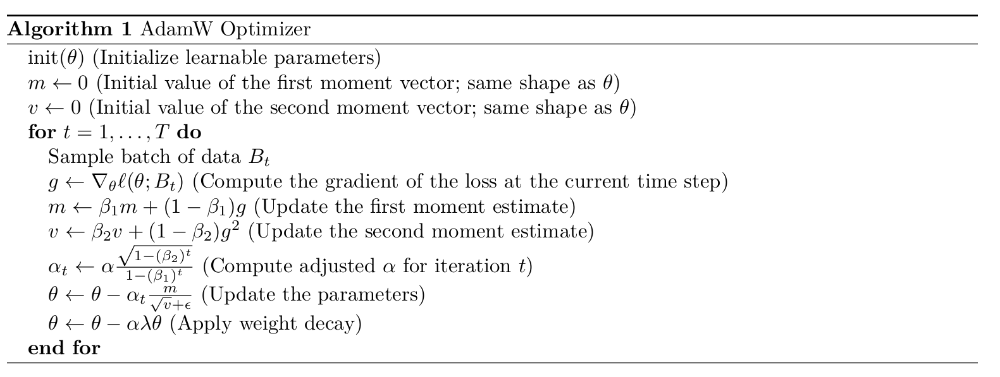

# Assignment 1 (basics): Building a Transformer LM

## 4 训练Transformer LM
我们现在已经有了通过分词器预处理数据和模型（Transformer）的步骤。接下来需要完成支持训练的所有代码，主要包括以下部分：
- 损失函数：需要定义损失函数（交叉熵）。
- 优化器：需要定义用于最小化该损失的优化器（AdamW）。
- 训练循环：需要构建所有支持性的基础设施，包括加载数据、保存检查点以及管理训练过程。

### 4.1 交叉熵损失
回顾一下，Transformer 语言模型为每个长度为 $m+1$ 的序列 $x$ 和每个位置 $i=1, \ldots, m$ 定义了一个分布 $p_{\theta}\!\left(x_{i+1}\mid x_{1:i}\right)$，意思是看见前 $i$ 个 token 去预测第 $i+1$ 个 token 是什么。给定一个由长度为 $m$ 的序列组成的训练集 $D$，我们定义标准的交叉熵（负对数似然）损失函数：
$$
\ell(\theta; D)
= \frac{1}{|D|\,m}
\sum_{x\in D}\sum_{i=1}^{m}
-\log p_{\theta}\!\left(x_{i+1}\mid x_{1:i}\right).
$$

其中 $\sum_{i=1}^{m}$ 表示一条序列里，每个位置都要预测一次下一个词（总共 $m$ 次）。$-\log p_{\theta}(\cdot)$ 表示如果模型给“正确答案 token”的概率越大，$−log$ 就越小，损失也就越小。 $\frac{1}{|D|\,m}$ 表示对数据条数和序列位置数做平均。注意：Transformer 的一次前向传播可以得到所有 $i=1, \ldots, m$ 对应的 $p_{\theta}\!\left(x_{i+1}\mid x_{1:i}\right)$。 

具体而言，Transformer 为每个位置 $i$ 计算 logits 向量 $o_i \in \mathbb{R}^{\text{vocab\_size}}$，从而得到：
$$
p\!\left(x_{i+1}\mid x_{1:i}\right)
= \mathrm{softmax}(o_i)[x_{i+1}]
= \frac{\exp\!\big(o_i[x_{i+1}]\big)}
{\sum_{a=1}^{\text{vocab\_size}} \exp\!\big(o_i[a]\big)}.
$$

可以把 $o_i[a]$ 理解为“位置 $i$ 预测下一个 token 是词表里第 $a$ 个 token 的打分”（未归一化）。交叉熵损失通常定义为关于 logits 向量 $o_i \in \mathbb{R}^{\text{vocab\_size}}$ 和目标值 $x_{i+1}$。

实现交叉熵损失时需要特别注意数值稳定性问题，这一点与 softmax 的实现类似。

---
**问题（cross_entropy）：实现交叉熵损失**
交付内容：编写一个函数来计算交叉熵损失，该函数接收预测的 logits $o_i$和目标值 $x_{i+1}$，并计算交叉熵 $\ell_i = −log(softmax(o_i)[x_{i+1}])$。你的函数应满足以下要求：
- 减去最大值以保证数值稳定性。
- 尽可能约去 log 和 exp 运算，避免数值溢出或下溢。
- 能够处理任意的批量（batch）维度，并对 batch 维度求平均后返回结果。

与第 3.3 节一样，我们假设批量相关的维度始终位于词汇表维度（vocab_size）之前。

代码可见 [cross_entropy.py](cross_entropy.py)

**困惑度（Perplexity）**
交叉熵足以用于训练，但在评估模型时，我们还希望报告困惑度，主要是用来评价语言模型“预测下一个词有多难/有多不确定”的指标。对于一个长度为 $m$ 的序列，若其对应的交叉熵损失分别为 $\ell_1,\ldots,\ell_m$：
$$
perplexity=\mathrm{exp}\left(\frac{1}{m}\sum_{i=1}^{m}\ell_i \right)
$$

在很多情况下可以把 PPL 理解成：模型在每一步相当于在 $K$ 个选项里“平均在猜”，这个 $K$ 就是困惑度。举例：
- 如果模型每步都像在 2 个词里均匀猜（正确词概率约 0.5）
  $\ell \approx -\log 0.5 = 0.693$，ppl $=e^{0.693}\approx 2$
- 如果每步正确词概率约 0.1
  $\ell\approx 2.302)，ppl (=e^{2.302}\approx 10$

所以 ppl 越大，说明模型越“困惑”，每一步要在更多可能里徘徊。


### 4.2 随机梯度下降优化器
现在我们有了损失函数，接下来将开始探索优化器。最简单的基于梯度的优化器是随机梯度下降（SGD）。我们从随机初始化的参数 $\theta_0$ 开始。然后对于每一步 $t=0,\ldots,T-1$，执行以下更新：
$$
\theta_{t+1} \leftarrow \theta_t - \alpha_t \nabla L(\theta_t; B_t),
$$

其中 $B_t$ 是从数据集 $D$ 中采样的随机批量数据，学习率 $α_t$ 和批量大小 $|Bt|$ 是超参数。

#### 4.2.1 在 PyTorch 中实现 SGD
要实现我们的优化器，我们将继承 PyTorch 的 `torch.optim.Optimizer` 类。一个 `Optimizer` 子类必须实现两个方法：
- `def __init__(self, params, ...)` 应初始化优化器。`params` 将是需要优化的参数集合（或参数组，如果用户想为模型的不同部分使用不同的超参数，例如不同的学习率）。确保将 params 传递给基类的 `__init__` 方法，该方法会将这些参数存储起来以供后续步骤使用。你可以根据优化器的需求添加额外的参数（例如，学习率是一个常见参数），并将它们**作为字典传递给基类构造函数**，字典中的键是你为这些参数选择的名称（字符串）。
- `def step(self)` 应执行一次参数更新。在训练循环中，这个方法会在反向传播后被调用，因此你可以访问到上一批数据的梯度。该方法应遍历每个参数张量 `p` 并就地修改它们，即设置 `p.data`，它保存了与该参数相关的张量，基于梯度 `p.grad`（如果存在的话）——该梯度是相对于该参数的损失梯度张量。

PyTorch 优化器 API 有一些微妙之处，所以用一个例子来解释会更简单。为了使示例更丰富，我们将实现 SGD 的一个变体，其中学习率随训练过程衰减，从一个初始学习率 $\alpha$ 开始，随着时间推移逐步缩小步长：
$$
\theta_{t+1} = \theta_t - \frac{\alpha}{\sqrt{t+1}} \nabla L(\theta_t; B_t),
$$

让我们看看如何将这个版本的 SGD 实现为 PyTorch Optimizer：
- 在 `__init__` 中，我们将参数以及默认的超参数传递给基类构造函数（参数可能以组的形式出现，每组具有不同的超参数）。如果参数只是单个 `torch.nn.Parameter` 对象的集合，基类构造函数将创建一个单独的组并将其分配给默认超参数。
- 在 `step` 中，我们迭代每个参数组，然后对组内的每个参数应用上述公式。在这里，我们将迭代次数作为状态与每个参数关联：首先读取此值，将其用于梯度更新，然后更新它。API 规定用户可能会传入一个可调用的 closure 来重新计算优化器步骤之前的损失。我们不需要为此优化器使用它，但为了符合 API，我们将其添加进来。

要查看其工作原理，我们可以使用以下最小化训练循环示例：
```python
from collections.abc import Callable, Iterable
from typing import Optional
import torch
import math

class SGD(torch.optim.Optimizer):
    def __init__(self, params, lr=1e-3):
        """
        简易SGD优化器，学习率按 sqrt(t+1) 衰减
        把要优化的参数收起来，并存好默认超参数（比如学习率 lr）
        把参数组织成 self.param_groups（参数组）
        把默认超参数也放进每个 group 里（所以后面能 group["lr"]）
        """
        if lr < 0:
            raise ValueError(f"Invalid learning rate: {lr}")
        defaults = {"lr": lr}
        super().__init__(params, defaults)
    
    def step(self, closure: Optional[Callable] = None):
        """
        执行一次参数更新
        支持可选的闭包函数用于重新计算模型
        """
        loss = None if closure is None else closure()

        for group in self.param_groups:
            lr = group["lr"]  # 当前参数组的学习率

            for p in group["params"]:
                if p.grad is None:
                    continue

                state = self.state[p]  # 获取参数状态（用于记录迭代次数）
                step_count = state.get("step_count", 0)  # 读取当前步数，初始为0
                grad = p.grad.data  # 梯度数据

                # 更新参数：权重衰减因子为 1/sqrt(step_count + 1)
                p.data -= lr / math.sqrt(step_count + 1) * grad

                # 步数递增并保存回状态
                state["step_count"] = step_count + 1

        return loss


# ------------------- 测试代码 -------------------
weights = torch.nn.Parameter(5 * torch.randn((10, 10)))  # 初始化可学习参数
opt = SGD([weights], lr=1)  # 创建优化器

for t in range(100):
    opt.zero_grad()              # 清零梯度
    loss = (weights**2).mean()   # 定义目标：最小化权重平方均值
    print(loss.cpu().item())     # 打印当前损失
    loss.backward()              # 反向传播计算梯度
    opt.step()                   # 更新参数
```

---
**问题（learning_rate_tuning）：调整学习率（1分）**
我们将看到，对训练影响最大的超参数之一就是学习率。让我们在之前的SGD示例中实践这一点：将学习率分别设置为1e1、1e2和1e3，仅运行10次训练迭代。对于每个学习率，损失值如何变化？它是下降得更快、更慢，还是发散（即在训练过程中损失值增加）？
提交内容：用一到两句话描述你观察到的现象。

在这个二次损失的测试里，**lr=1e1** 时 loss 稳定、逐步下降；**lr=1e2** 时一开始会出现一次“翻转”导致 loss 基本不变，但随后会在几步内迅速下降到接近 0；而 **lr=1e3** 时更新步长过大，loss 很快爆炸式增大并发散。

### 4.3 AdamW
现代语言模型通常使用比SGD更复杂的优化器进行训练。最近广泛使用的优化器大多源自 Adam 优化器 [Kingma 和 Ba, 2015]。我们将使用 AdamW [Loshchilov 和 Hutter, 2019]，这是近期研究中广泛采用的一种优化器。AdamW 对 Adam 进行了改进，通过引入权重衰减（在每次迭代中将参数向0拉近）来提升正则化效果，并且该权重衰减与梯度更新解耦。我们将按照 Loshchilov 和 Hutter [2019]论文中算法2的描述来实现 AdamW。

AdamW 是有状态的：对每个参数，它会维护其一阶和二阶矩的滑动估计值。因此，AdamW 以额外的内存消耗为代价，换取了更好的训练稳定性和收敛性。除了学习率 $\alpha$ 外，AdamW 还包含一对控制矩估计更新的超参数 ($\beta_1, \beta_2$)，以及一个权重衰减率 $\lambda$。通常情况下，($\beta_1, \beta_2$) 设为 (0.9, 0.999)，但像 LLaMA [Touvron 等, 2023] 和 GPT-3 [Brown 等, 2020] 这样的大语言模型通常使用 (0.9, 0.95)。该算法可表述如下，其中 $\epsilon$ 是一个很小的值（例如 $10^{-8}$），用于在 $v$ 出现极小值时提升数值稳定性：

请注意，$t$ 从 1 开始。现在，您将实现此优化器。

---
**问题（adamw）：实现 AdamW（2 分）**
提交要求：将 AdamW 优化器实现为 `torch.optim.Optimizer` 的子类。你的类在 `__init__` 中应接收学习率 $\alpha$，以及超参数 $\beta_1$、$\beta_2$、$\epsilon$ 和 $\lambda$。为了帮助你维护状态，基类 Optimizer 提供了一个字典 `self.state`，它将 `nn.Parameter` 对象映射到一个字典，用于存储该参数所需的任何信息（对 AdamW 而言，即一阶和二阶矩估计值）。

代码可见 [adamw.py](adamw.py)

---
**问题（adamwAccounting）：使用 AdamW 训练的资源核算（2 分）**
让我们计算运行 AdamW 所需的内存和计算量。假设所有张量均使用 float32（每个元素占 4 字节）。

(a) 运行 AdamW 所需的峰值内存是多少？请根据参数、激活值（activations）、梯度和优化器状态的内存使用情况分解回答。用 batch_size 和模型超参数（vocab_size、context_length、num_layers、d_model、num_heads）表示你的答案。假设 d_ff = 4 × d_model。为简化激活值的内存计算，仅考虑以下组件：
- Transformer 块：
  - RMSNorm(s)
  - 多头自注意力子层：QKV 投影、QᵀK 矩阵乘法、softmax、加权求和（value 加权和）、输出投影
  - 位置前馈网络（FFN）：W1 矩阵乘法、SiLU 激活、W2 矩阵乘法
- 最终的 RMSNorm
- 输出嵌入（output embedding）
- logits 上的交叉熵损失

提交要求：分别给出参数、激活值、梯度和优化器状态的代数表达式，以及总内存的表达式。

---
(b) 将你的答案代入一个 GPT-2 XL 规模的模型，得到仅依赖于 batch_size 的表达式。在不超过 80GB 内存的前提下，最大 batch_size 是多少？
提交要求：形如 a·batch_size + b 的表达式（其中 a、b 为具体数值），以及最大 batch_size 的数值。

---
(c) 运行一步 AdamW 需要多少次浮点运算（FLOPs）？
提交要求：一个代数表达式，并附简要说明。

---
(d) 模型 FLOPs 利用率（Model FLOPs Utilization, MFU）定义为实际吞吐量（每秒处理的 token 数）与硬件理论峰值 FLOPs 吞吐量的比值 [Chowdhery et al., 2022]。一块 NVIDIA A100 GPU 的 float32 峰值性能为 19.5 teraFLOP/s。假设你能达到 50% 的 MFU，训练一个 GPT-2 XL 模型，共 400K 步，每步 batch_size = 1024，在单块 A100 上需要多长时间？根据 Kaplan et al. [2020] 和 Hoffmann et al. [2022] 的假设，反向传播的 FLOPs 是前向传播的两倍。

提交要求：训练所需的天数，并附简要说明。

### 4.4 学习率调度
导致损失最快减少的学习率值在训练过程中常常会发生变化。在训练 Transformer 模型时，通常采用学习率调度策略：先使用较大的学习率，在训练初期进行更快速的更新，再随着模型的训练逐渐将其衰减至较小的值。在本作业中，我们将实现用于训练 LLaMA 的余弦退火调度策略 [Touvron et al., 2023]。

调度器本质上是一个函数，它接收当前步数 $t$ 和其他相关参数（如初始学习率和最终学习率），并返回在第 $t$ 步梯度更新时应使用的学习率。最简单的调度器是常函数，它会针对任意 $t$ 返回相同的学习率。

余弦退火学习率调度器需要以下输入：(i) 当前迭代次数 $t$，(ii) 最大学习率 $\alpha_{max}$，(iii) 最小（最终）学习率 $\alpha_{min}$，(iv) 预热迭代次数 $T_w$，以及 (v) 余弦退火迭代次数 $T_c$。第 $t$ 次迭代时的学习率定义如下：
- **预热阶段**：若 $t < T_w$，则 $\alpha_t = \frac{t}{T_w}\,\alpha_{\max}.$
- **余弦退火阶段**：若 $T_w \le t \le T_c$，则 $\alpha_t = \alpha_{\min} + \frac{1}{2}\left(1+\cos\!\left(\frac{t-T_w}{T_c-T_w}\pi\right)\right)(\alpha_{\max}-\alpha_{\min}).$

- **退火后阶段**：若 $t > T_c$，则 $\alpha_t = \alpha_{\min}.$

---
**问题（learning_rate_schedule）：实现带预热的余弦学习率调度**
编写一个函数，该函数接收参数 $t$（当前训练步数）、$\alpha_{max}$（最大学习率）、$\alpha_{min}$（最小学习率）、$T_w$（预热步数）和 $T_c$（总训练步数），并根据上述定义的学习率调度策略返回当前步数对应的学习率 $α_t$。

代码可见 [lr_cosine_shedule.py](lr_cosine_shedule.py)


### 4.5 梯度裁剪
在训练过程中，我们有时会遇到产生较大梯度的训练样本，这可能会导致训练不稳定。为缓解这一问题，实践中常用的一种技术是梯度裁剪（gradient clipping）。其核心思想是在每次反向传播后，对梯度的范数施加一个上限。

给定所有参数的梯度 $g$，我们计算其 $\ell_2$-范数$\lVert g\rVert_2$。如果该范数小于最大值 $M$，则保持 $g$ 不变；否则，我们将 $g$ 缩放因子为 $\frac{M}{\lVert g\rVert_2+\epsilon}$（其中添加了一个很小的 $\epsilon$ ，如 $10^{−6}$，以确保数值稳定性）。注意，缩放后的范数将略小于 $M$。

---
**问题（gradient_clipping）：实现梯度裁剪（1 分）**
编写一个函数来实现梯度裁剪。你的函数应该接收一组参数和一个最大 $\ell_2$-范数，并就地修改每个参数的梯度。使用 $\epsilon=10^{−6}$（这是 PyTorch 的默认值）。

代码可见 [gradient_clip.py](gradient_clip.py)

