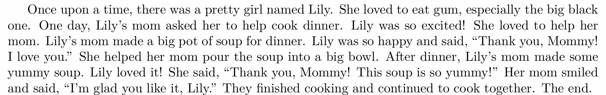
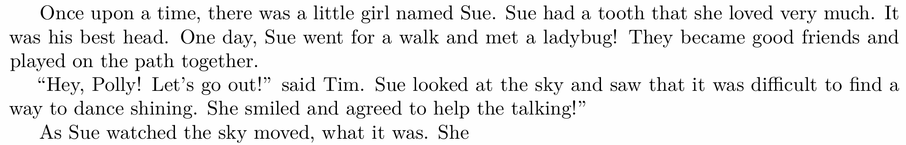

# Assignment 1 (basics): Building a Transformer LM

## 7 Experiments
现在是时候将所有内容整合起来，并在预训练数据集上训练（小型）语言模型了。

### 7.1 如何运行实验并提交成果
要真正理解 Transformer 架构组件背后的设计原理，最好的方法就是亲自修改并运行它。动手实践是无可替代的。

为此，能够快速、一致地进行实验，并记录下所做的一切至关重要。为了实现快速实验，我们将使用一个小型模型（1700万参数）和一个简单的数据集（TinyStories）进行多次小规模实验。为了确保实验的一致性，你需要以系统化的方式对各个组件进行消融分析，并调整超参数。同时，为了保留实验记录，我们要求你提交一份实验日志，以及每次实验对应的学习曲线。

为了能够提交损失曲线，请务必定期评估验证集上的损失，并记录训练的步数和实际耗时（wallclock time）。你可能会发现像 Weights and Biases 这样的日志记录工具非常有帮助。

---
**问题（experiment_log）：实验日志记录（3分）**
为你的训练和评估代码建立实验跟踪基础设施，以便能够根据梯度更新步数（gradient steps）和实际耗时（wallclock time）来追踪实验过程和损失曲线。
交付内容：实验的日志记录基础设施代码，以及一份实验日志（即本节后续作业问题中你所尝试的所有内容的记录文档）。

### 7.2 TinyStories
我们将从一个非常简单的数据集（TinyStories；Eldan 和 Li，2023）开始，在该数据集上模型训练速度很快，同时我们也能观察到一些有趣的行为。获取该数据集的说明请参见第1节。

**超参数调优**
我们会为你提供一些基本的超参数作为起点，然后请你通过实验找出其他超参数的良好设置。
- **vocab_size（词汇表大小）**: 10000。典型的词汇表大小通常在几万到几十万之间。你可以尝试调整该值，观察词汇表大小对模型行为的影响。
- **context_length（上下文长度）**: 256。像 TinyStories 这样的简单数据集可能不需要很长的序列长度，但在后续使用 OpenWebText 数据时，你可能需要调整该值。尝试改变上下文长度，观察其对每次迭代的运行时间和最终困惑度（perplexity）的影响。
- **d_model（模型维度）**: 512。这比许多小型 Transformer 论文中常用的 768 维略小，但可以加快训练速度。
- **d_ff（前馈网络维度）**: 1344。这大约是 d_model 的 8/3 倍，同时是 64 的倍数，有利于 GPU 性能优化。
- **RoPE theta 参数（Θ）**: 10000。
- **层数与注意力头数**: 4 层，16 个注意力头。这样的配置总共约有 1700 万个非嵌入参数，是一个相对较小的 Transformer 模型。
- **总处理 token 数**: 327,680,000（你的 batch size × 总训练步数 × 上下文长度 应大致等于该值）。

你需要通过一些试错，为以下超参数找到合适的默认值：
- 学习率（learning rate）
- 学习率预热步数（learning rate warmup）
- 其他 AdamW 超参数（$\beta_1$, $\beta_2$, $\epsilon$）
- 权重衰减（weight decay）

这些超参数的典型取值可参考 Kingma 和 Ba [2015] 的论文。

**整合所有内容**
现在，你可以将所有部分整合起来：获取一个训练好的 BPE 分词器，对训练数据集进行分词，并在你编写的训练循环中运行模型。
重要提示：如果你的实现正确且高效，上述超参数在 1 块 H100 GPU 上的运行时间应大约为 30–40 分钟。如果你的运行时间显著更长，请检查你的数据加载、模型保存或验证损失计算代码是否存在性能瓶颈，并确保你的实现已正确地进行了批处理（batched）。

代码可见 [final_train.py](final_train.py)

**文本生成**
现在你已经拥有了训练好的解码器，我们可以开始生成文本了！我们将基于模型进行文本生成，并评估其生成质量。作为参考，你生成的文本至少应达到如下示例的水平：
示例（ts_generate_example）：TinyStories 语言模型的生成样本

**低资源/降配提示：在 CPU 或 Apple Silicon 上生成文本**
如果你使用的是低资源配置（仅处理了 4000 万个 token），你生成的文本应仍能大致符合英语语法结构，但流畅度和连贯性不如上述高资源训练的模型。例如，我们在 40M token 配置下训练的 TinyStories 语言模型生成的样本如下：

---
**问题（generate）：生成文本（1分）**
使用你的解码器和训练好的检查点，报告你的模型生成的文本。你可能需要调整解码器参数（如温度、top-p 等）以获得流畅的输出。
交付内容：至少 256 个 token 的文本输出（或直到第一个 token 为止），以及一段简要评论，说明该输出的流畅程度，以及至少两个影响此输出质量好坏的因素。

代码可见 [final_inference.py](final_inference.py)

### 7.3 消融实验与架构修改
理解 Transformer 的最佳方式就是实际修改它，并观察其行为变化。现在我们将进行一些简单的消融实验和架构修改。

**消融实验1：层归一化（layer normalization）**
人们常说，层归一化对 Transformer 训练的稳定性至关重要。但也许我们想“铤而走险”。现在，让我们从每个 Transformer 模块中移除 RMSNorm，然后观察会发生什么。

---
**问题（layer_norm_ablation）：移除 RMSNorm 并训练（1分）（1 H100 小时）**
从你的 Transformer 中移除所有 RMSNorm 层并进行训练。在之前的最优学习率下会发生什么？你能否通过使用更低的学习率来获得稳定性？
交付内容：移除 RMSNorm 后进行训练的学习曲线，以及使用最佳学习率时的学习曲线。
交付内容：几句关于 RMSNorm 影响的简要评论。

现在让我们研究另一种在第一眼看来似乎随意的层归一化选择。Pre-norm Transformer块定义为：
$$
z = x + \mathrm{MultiHeadedSelfAttention}(\mathrm{RMSNorm}(x))
$$$$
y = z + \mathrm{FFN}(\mathrm{RMSNorm}(z)).
$$

这是对原始Transformer架构少数几个“共识”修改之一，原始架构采用的是post-norm方法，其形式如下：
$$
z = \mathrm{RMSNorm}\!\left(x + \mathrm{MultiHeadedSelfAttention}(x)\right)
$$$$
y = \mathrm{RMSNorm}\!\left(z + \mathrm{FFN}(z)\right).
$$

让我们回到post-norm方法，看看会发生什么。

---
**问题（pre_norm_ablation）：实现并训练后归一化模型（1分）（1个H100小时）**
将你的预归一化Transformer实现修改为后归一化。使用后归一化模型进行训练，观察会发生什么。
交付成果：后归一化Transformer的学习曲线，并与预归一化模型进行比较。

我们看到，层归一化对Transformer的行为有重大影响，甚至层归一化的位置也非常重要。

---
**消融实验2：位置嵌入**
接下来，我们将研究位置嵌入对模型性能的影响。具体来说，我们将把基础模型（使用RoPE）与完全不包含位置嵌入（NoPE）的情况进行比较。事实证明，仅解码器的Transformer（即我们所实现的带有因果掩码的模型）理论上可以在没有显式提供位置嵌入的情况下推断出相对或绝对的位置信息 [Tsai et al., 2019, Kazemnejad et al., 2023]。现在我们将通过实验验证NoPE与RoPE相比的表现如何。

---
**问题（no_pos_emb）：实现无位置嵌入（NoPE）（1分）（1个H100小时）**
将你使用RoPE的Transformer实现修改为完全移除位置嵌入信息，观察会发生什么。
交付成果：一条对比RoPE与NoPE性能的学习曲线。

---
**消融实验3：SwiGLU 与 SiLU**
接下来，我们将遵循 Shazeer [2020] 的方法，通过比较使用 SwiGLU 的前馈网络与仅使用 SiLU 激活函数但不包含门控线性单元（GLU）的前馈网络的性能，来测试前馈网络中门控机制的重要性：
$$
\mathrm{FFN}_\mathrm{SLU}(x)=W_2\mathrm{SiLU}(W_1x)
$$

回顾一下，在我们的 SwiGLU 实现中，我们将内部前馈层的维度设置为大约 $d_{ff}=\frac{8}{3}d_{model}$（同时确保 $d_{ff}~mod~64=0$，以便利用 GPU 的张量核心）。在你的 $\mathrm{FFN}_\mathrm{SLU}$ 实现中，应将 $d_{ff}=4 \times d_{model}$，以大致匹配 SwiGLU 前馈网络的参数数量（SwiGLU 使用三个权重矩阵，而此处为两个）。

---
**问题（swiglu_ablation）：SwiGLU 与 SiLU 对比（1分）（1个H100小时）**
交付成果：一条对比 SwiGLU 与 SiLU 前馈网络性能的学习曲线，两者参数量大致相当。
交付成果：几句话，简要讨论你的发现。
低资源/降规模提示：在线且GPU资源有限的学生应在TinyStories上测试修改

在本作业的后续部分，我们将转向更大规模、噪声更多的网络数据集（OpenWebText），实验不同的架构修改，并（可选）向课程排行榜提交结果。
在OpenWebText上将语言模型训练到流利程度需要很长时间，因此我们建议GPU资源有限的在线学生继续在TinyStories上测试修改（使用验证损失作为评估性能的指标）。

### 7.4 OpenWebText
我们现在将转向一个更为标准的、由网络爬取数据构建的预训练数据集。OpenWebText [Gokaslan et al., 2019] 的一个小样本也以单个文本文件的形式提供：参见第1节了解如何访问该文件。
注意：你可能需要为此实验重新调整你的超参数，例如学习率或批量大小。

---
**问题（main_experiment）：在OWT上的实验（2分）（3个H100小时）**
使用与TinyStories相同的模型架构和总训练步数，在OpenWebText上训练你的语言模型。该模型表现如何？

交付成果：你的语言模型在OpenWebText上的学习曲线。描述与TinyStories相比损失值的差异——我们应如何解释这些损失？

交付成果：从OpenWebText语言模型生成的文本，格式与TinyStories的输出相同。这段生成文本的流畅性如何？尽管我们使用了与TinyStories相同的模型和计算预算，为什么输出质量更差？