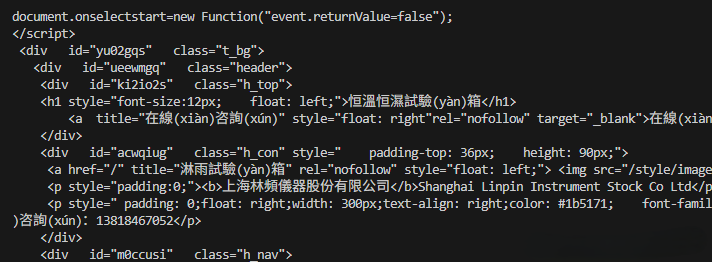

# CS336 Assignment 4 (data): Filtering Language Modeling Data

## 2 过滤 Common Crawl 数据集
大型语言模型主要基于互联网数据训练，但大多数研究人员不会为模型训练数据构建专属网络爬虫，而是使用公开可用的爬虫数据集。最受欢迎的公开网络爬虫数据集来自 [Common Crawl](https://commoncrawl.org/)——一家非营利组织，提供免费的网页语料库，涵盖“17 年间的超 2500 亿个网页”。

然而，将 Common Crawl（CC）数据转储转换为可用的语言模型训练数据需要大量工作。例如，网页原始数据为 HTML 格式，我们需要从中提取文本；此外，许多网页可能质量低下、存在完全或近乎重复的内容、包含有害信息或敏感数据，因此我们需要过滤掉这些网页，或从数据集中移除内容中不符合要求的部分。本次作业中，你将搭建一个包含多个处理步骤的流水线，将原始互联网数据转换为可用的语言模型训练集。

### 2.1 数据初探
在开始实现任何功能前，查看原始数据并建立初步认知总是有益的。CC 数据提供三种格式：
- WARC（“Web 归档格式 - Web ARChive format”）文件：包含原始 CC 数据，具体包括页面 ID、URL、元数据和 HTTP 请求详情（例如，请求日期和时间、服务器 IP 地址），以及网页原始内容（例如，HTML）。
- WAT（“Web 归档转换 - Web Archive Transformation””）文件：包含从 WARC 文件中提取的高层级元数据，以 JSON 对象形式存储。例如，对于 HTML 页面，包含该页面的链接列表和页面标题。
- WET（“Web 提取文本 - Web Extracted Text”）文件：包含从原始 HTML 页面中提取的纯文本。

针对以下问题，我们将查看一个 WARC 文件及其对应的 WET 文件。这些文件来自 2018 年 4 月的爬虫数据集，可通过以下命令下载：
```bash
# 下载示例 WARC 文件
$ wget https://data.commoncrawl.org/crawl-data/CC-MAIN-2025-18/segments/1744889135610.12/warc/CC-MAIN-20250417135010-20250417165010-00065.warc.gz
# 下载对应的 WET 文件
$ wget https://data.commoncrawl.org/crawl-data/CC-MAIN-2025-18/segments/1744889135610.12/wet/CC-MAIN-20250417135010-20250417165010-00065.warc.wet.gz
```
在 Together 集群中，这些文件位于以下路径：
- /data/CC/example.warc.gz
- /data/CC/example.warc.wet.gz

警告：这些文件包含完全未过滤的互联网页面，可能包含大量潜在有害内容。若遇到不想阅读的文档，可直接滚动跳过。

**问题（数据初探）：4 分**
(a) 下载上述 WARC 文件，或使用集群中提供的副本。查看该文件中的第一个页面。该文件为 gzip 压缩格式，可通过以下命令浏览内容：
```bash
$ zcat /data/CC/example.warc.gz | less
```
`less` 命令支持使用键盘方向键、Page Up、Page Down 浏览文件，按“q”退出。查看第一个网页，其 URL 是什么？该 URL 仍可访问吗？通过查看原始 HTML，你能判断该页面大致主题是什么？

提交要求：2-3 句话的回答。
答：从`WARC-Target-URI: http://0371rykj.com/ipfhsb/34.html`中可以看到这个链接；打开是空白网页。看文本内容可知，它原来是“上海林頻儀器股份有限公司”的网址。


(b) 查看对应的 WET 文件：
```bash
$ zcat /data/CC/example.warc.wet.gz | less
```
注意，WET 文件包含 HTTP 头（例如，Content-Length），这些不属于提取的文本内容。查看第一个示例，你会发现其中包含从刚才看到的原始 HTML 中提取的文本。
注意到，提取的文本中很大一部分带有 HTML 结构的痕迹，并非页面的核心内容。你认为提取器应过滤掉文本中的哪些部分？从训练数据质量的角度思考：使用此类文本训练模型可能会出现什么问题？相反，模型可能从该页面中提取到哪些有用信息？
- 提取器应过滤掉HTML标签、脚本代码、样式表、导航菜单、页眉页脚等非正文内容。直接使用含HTML结构的文本训练，会导致模型学习到无关的标记模式，降低对自然语言的理解能力，并可能产生包含HTML片段的不良输出。但从这类页面中，模型仍可能提取到技术术语、产品描述等特定领域的词汇和概念。

(c) 优质训练样本的定义具有极强的场景相关性。请描述一个该示例可能对其训练数据有用的应用领域，以及一个可能无用的应用领域。
提交要求：1-2 句话的回答。

(d) 查看更多示例以更好地了解 Common Crawl 的数据内容。浏览另外 25 个 WET 记录，对每个记录简要说明文档的语言（若能识别）、域名、页面类型等信息。需要查看多少个示例才能找到一个你认为的“高质量”网页？
提交要求：对 25 个文档的简要标注（包括语言、域名、页面类型及其他相关说明），以及找到高质量示例所需的浏览数量。

### 2.2 HTML 转文本转换
从之前对 WARC 和 WET 文件的查看中，你可能已经意识到从 HTML 中提取文本具有一定挑战性。通常，任何提取流程都会查找 HTML 中的可见内容（例如，本应包含文本块的 `<p>` 标签），但这仍可能提取出远超我们在网页浏览器中打开页面时所感知的核心内容的信息。例如，打开 Stack Overflow 时，核心内容是问题和回答，但从技术上讲，菜单选项、指向其他 Stack Exchange 无关页面的链接、页脚、注册或登录链接——这些均为可见文本，而要可靠地将其与页面核心内容区分开具有一定难度。

许多工具都实现了文本提取流水线。本次作业中，我们将使用 [Resiliparse](https://resiliparse.chatnoir.eu/en/stable/index.html) 库执行文本提取。Resiliparse 还能帮助解决一个更基础的问题：检测包含原始内容的字节数据的文本编码。尽管互联网上大多数页面采用 UTF-8 编码（根据维基百科，占比 98.2%），但我们的文本提取流水线仍需对其他编码具有鲁棒性。

注意：建议使用 FastWARC 库迭代处理每个 WARC 文件中的记录。以下类可能会有所帮助：
```python
from fastwarc.warc import ArchiveIterator, WarcRecordType
```
**问题（文本提取）：3 分**
(a) 编写一个函数，从包含原始 HTML 的字节字符串中提取文本。使用 `resiliparse.extract.html2text.extract_plain_text` 执行提取。该函数需要输入字符串，因此你需要先将字节字符串解码为 Unicode 字符串。注意，输入字节字符串可能并非 UTF-8 编码，因此当 UTF-8 解码失败时，你的函数应能检测编码。Resiliparse 提供的 `resiliparse.parse.encoding.detect_encoding()` 可能会有所帮助。

提交要求：一个接收包含 HTML 的字节字符串并返回提取文本字符串的函数。实现接口 `[run_extract_text_from_html_bytes]`，并确保通过测试 `uv run pytest -k test_extract_text_from_html_bytes`。

代码可见 [extract_text.py](extract_text.py)

(b) 在单个 WARC 文件上运行你的文本提取函数，将其输出与对应的 WET 文件中的提取文本进行比较。你发现了哪些差异和/或相似之处？哪种提取结果更好？
提交要求：2-3 句话的回答，对比你的函数提取的文本与 WET 文件中的提取文本。

### 2.3 语言识别
网络包含数以千计语言编写的页面。然而，在计算资源有限的条件下，训练一个能有效利用如此多样化大规模数据的多语言模型仍然面临挑战。因此，许多基于 Common Crawl 构建的语言模型训练数据集往往仅涵盖有限语种的数据。

[fastText](https://fasttext.cc) 是一个实用的库，提供高效的文本分类器。该库既提供了在自定义数据上训练分类器的框架，也包含一系列预训练模型，包括语言识别模型。你可从 `https://fasttext.cc/docs/en/language-identification.html` 下载 fastText 语言识别模型 `lid.176.bin`；该模型在 Together 集群中也可通过路径 `/data/classifiers/lid.176.bin` 获取。

通常，语言过滤器会使用分类器给出的分数来决定是否保留某个页面。使用 fastText 语言识别分类器实现一个语言识别过滤器，该过滤器应返回一个非负分数，表示其对预测结果的置信度。

**问题（语言识别）：6 分**
(a) 编写一个函数，接收一个 Unicode 字符串并识别其中的主要语言。该函数应返回一个元组，包含语言标识符和一个 0 到 1 之间表示预测置信度的分数。

提交要求：一个执行语言识别并返回顶级语言预测结果及分数的函数。实现接口 `[run_identify_language]`，并确保通过 `uv run pytest -k test_identify_language` 中的两个测试。注意，这些测试假设英语（“en”）和中文（“zh”）有特定的字符串标识符，因此你的测试接口需根据需要执行相应的映射。

代码可见 [language_identification.py](language_identification.py)

(b) 语言模型在推理时的行为很大程度上取决于其训练数据。因此，数据过滤流水线中的问题可能会导致后续出现问题。你认为语言识别流程中可能会出现哪些问题？在高风险场景（例如，部署面向用户的产品时），你会如何缓解这些问题？
提交要求：2-5 句话的回答。

对低资源语言识别准确率低、混合语言文本误判、含噪声文本（如代码、特殊符号）导致错误分类，以及训练数据偏差造成的系统性偏见。在高风险场景中，可采取以下缓解措施：对识别结果设置置信度阈值并在低置信时触发人工审核或回退机制。

(c) 在通过你之前实现的文本提取函数从 WARC 文件中提取的文本上运行你的语言识别系统。手动识别 20 个随机示例的语言，并将你的标签与分类器预测结果进行比较。报告分类器的任何错误。有多少比例的文档是英语？基于你的观察，在过滤时应使用什么合适的分类器置信度阈值？
提交要求：2-5 句话的回答。

### 2.4 Personal identifiable information
互联网包含大量可用于联系或识别个人的信息，例如电子邮件地址、电话号码或 IP 地址。我们不希望面向用户的语言模型输出有关真实个人的此类信息，因此常见的处理步骤是在训练数据集中对这些信息进行掩码处理。

你需要实现三种掩码处理流程，分别用于掩码（a）电子邮件地址、（b）电话号码和（c）IP 地址。

**问题（个人身份信息掩码）：3 分**
(a) 编写一个掩码电子邮件地址的函数。该函数接收一个字符串作为输入，将所有电子邮件地址替换为字符串 `“|||EMAIL_ADDRESS|||”`。可通过查找可靠的正则表达式来检测电子邮件地址。
提交要求：一个将输入字符串中所有电子邮件地址替换为 `“|||EMAIL_ADDRESS|||”` 的函数，返回包含新字符串和掩码实例数量的元组。实现接口 `[run_mask_emails]`，并确保通过 `uv run pytest -k test_mask_emails` 中的所有测试。

代码可见 [filter_email.py](filter_email.py)

(b) 编写一个用于屏蔽电话号码的函数。该函数接收一个字符串作为输入，并将其中所有电话号码替换为字符串 `“|||PHONE_NUMBER|||”`。要可靠地完成这一任务可能极具挑战性，因为电话号码的书写格式极其多样。但你至少应能识别并处理美国最常用的电话号码格式，并对轻微的语法变体（如不同的分隔符或空格）具有鲁棒性。
交付成果：编写一个函数，将给定字符串中的电话号码替换为 `“|||PHONE_NUMBER|||”`，返回包含新字符串和被屏蔽实例数量的二元组。实现适配器 `[run_mask_phone_numbers]`，并确保通过 `uv run pytest -k test_mask_phones` 测试。

代码可见 [filter_phone_number.py](filter_phone_number.py)

(c) 编写一个屏蔽 IP 地址的函数。本题仅需关注 IPv4 地址（4 个不超过 255 的数字，以点分隔）。函数接收字符串作为输入，将所有 IPv4 地址替换为 `“|||IP_ADDRESS|||”`。
交付成果：编写一个函数，将给定字符串中的 IPv4 地址替换为 `“|||IP_ADDRESS|||”`，返回包含新字符串和被屏蔽实例数量的二元组。实现适配器 `[run_mask_ips]`，并确保通过 `uv run pytest -k test_mask_ips` 测试。

代码可见 [filter_ip.py](filter_ip.py)

(d) 若在训练集中简单应用这些过滤器，你认为可能会给语言模型后续带来哪些问题？如何缓解这些问题？
交付成果：2-5 句话的回答。

问题： 在训练数据中简单地把电话、IP 等直接替换成固定占位符（如 `|||PHONE_NUMBER|||`），会导致：
1. 模型学不会真实格式和上下文用法；
2. 推理时可能乱生成占位符或无法生成合法号码/IP；
3. 技术语义（如 `127.0.0.1`）丢失，影响专业任务。

缓解方法（简单有效）： 用保留格式的假数据替换，例如：
- 电话 → `(555) 123-4567`（北美保留号段）
- IP → `192.0.2.1`（IANA 文档专用地址）

这样既保护隐私，又保持语言结构和语义，模型训练更自然、推理更准确。

(e) 在从 WARC 文件提取的文本上（通过你之前实现的文本提取函数）运行个人身份信息（PII）屏蔽函数。随机查看 20 个已进行替换的示例；给出一些误报和漏报的案例。
交付成果：2-5 句话的回答。

### 2.5 有害内容
未经筛选的网络数据包含大量文本，我们不希望语言模型在推理时重复这些内容。其中一些训练示例甚至可能来自通常无害的网站（如维基百科）——例如，用户在多个页面留下的评论可能具有较强的毒性。尽管很难为“有害内容”划定明确界限，但许多数据筛选流程仍会对主要包含有害内容的页面进行筛选。

识别此类内容的方法有很多，包括统计禁用词列表中的词汇数量，或基于人工标注的标签构建简单分类器。在本作业的这一部分，我们将重点识别两大类有害内容：“不适合工作场景（NSFW）”（包括色情内容、亵渎性语言或其他可能令人不适的内容）和有毒言论（“粗鲁、无礼或不合理的语言，可能导致他人退出讨论”）。我们将使用 Dolma 项目 [Soldaini 等人，2024] 提供的预训练 fasttext 模型，判断输入文本是否属于上述任一类别。这些分类器在 Jigsaw 有毒评论数据集上训练而成，该数据集包含多种标签分类的维基百科评论。

NSFW 分类器可通过以下链接下载：
`dolma-artifacts.org/fasttext_models/jigsaw_fasttext_bigrams_20230515/jigsaw_fasttext_bigrams_nsfw_final.bin`

仇恨言论分类器可通过以下链接下载：
`dolma-artifacts.org/fasttext_models/jigsaw_fasttext_bigrams_20230515/jigsaw_fasttext_bigrams_hatespeech_final.bin`

我们也已将这两个分类器放置在 Together 集群中：
`/data/classifiers/dolma_fasttext_hatespeech_jigsaw_model.bin`：用于仇恨言论和有毒言论的预训练分类器
`/data/classifiers/dolma_fasttext_nsfw_jigsaw_model.bin`：用于 NSFW 内容的预训练分类器

请使用这些模型实现一个函数，该函数接收包含页面内容的 Unicode 字符串，返回标签（如“有毒”“无毒”）及置信度分数。

**题目（有害内容）：6 分**
(a) 编写一个检测 NSFW 内容的函数。
交付成果：编写一个函数，判断给定字符串是否包含 NSFW 内容，返回包含标签和置信度分数的二元组。实现适配器 `[run_classify_nsfw]`，并确保通过 `uv run pytest -k test_classify_nsfw` 测试。注意，该测试仅为合理性检查（取自 Jigsaw 数据集），绝不代表你的分类器准确无误，你应对其准确性进行验证。

代码可见 [detect_nsfw.py](detect_nsfw.py)

(b) 编写一个检测有毒言论的函数。
交付成果：编写一个函数，判断给定字符串是否为有毒言论，返回包含标签和置信度分数的二元组。实现适配器 `[run_classify_toxic_speech]`，并确保通过 `uv run pytest -k test_classify_toxic_speech` 测试。同样，该测试仅为合理性检查（亦取自 Jigsaw 数据集）。

代码可见 [detect_toxic_speech.py](detect_toxic_speech.py)

(c) 若将这些过滤器应用于训练集构建，你认为可能会给语言模型后续带来哪些问题？如何缓解这些问题？
交付成果：2-5 句话的回答。

(d) 在从 WARC 文件提取的文本上（通过你之前实现的文本提取函数）运行有害内容过滤器。随机查看 20 个示例，将分类器预测结果与你自己的判断进行比较。报告分类器的任何错误。有害文档占比多少？基于你的观察，筛选时应使用何种合适的分类器置信度阈值？
交付成果：2-5 句话的回答。

### 2.6 Quality Rules
即使经过语言筛选和有害内容移除，剩余页面中仍有相当一部分对语言模型训练而言质量较低。同样，“质量”的定义并不明确，但查看 Common Crawl 示例有助于识别低质量内容，例如：
- 付费墙内容页面
- 失效链接的占位符页面
- 登录、注册或联系表单
- 主要包含非文本内容的页面（如图片、视频），这些内容在文本提取过程中会丢失

Gopher 论文 [Rae 等人，2021] 描述了一组简单的质量过滤器，用于从网络爬取数据中移除类似的简单低质量文本案例。这些过滤器由易于理解的启发式规则组成，通常能覆盖许多明显不适合作为训练数据的示例。Gopher 质量过滤器包含多个基于文档长度、单词长度、符号与单词比率以及特定英语停用词存在情况的标准。在本作业中，你将实现 Gopher 论文 [Rae 等人，2021] 中描述的部分过滤器。具体而言，你应移除以下文档：
- 单词数少于 50 或多于 100,000 的文档。
- 平均单词长度超出 3 至 10 个字符范围的文档。
- 超过 30% 的行以省略号（“…”）结尾的文档。
- 包含至少一个字母的单词占比低于 80% 的文档。

有关 Gopher 论文使用的所有质量过滤器的完整描述，请参阅其附录 A。

**题目（Gopher 质量过滤器）：3 分**
(a) 实现（至少）上述描述的 Gopher 质量过滤器子集。将文本分词为单词时，你可能会发现 NLTK 包（特别是 `from nltk.tokenize import word_tokenize`）很有用，但不强制要求使用该包。
交付成果：编写一个函数，仅接收一个字符串作为参数，返回一个布尔值，指示该文本是否通过 Gopher 质量过滤器。实现适配器 `[run_gopher_quality_filter]`。然后，确保你的过滤器通过 `uv run pytest -k test_gopher` 中的测试。
注意，如果使用 nltk 的话，需要先下载一个模型 `nltk.download('punkt_tab')`

代码可见 [quality_rule.py](quality_rule.py)

(b) 在从 WARC 文件提取的文本上（通过你之前实现的文本提取函数）运行基于规则的质量过滤器。随机查看 20 个示例，将过滤器预测结果与你自己的判断进行比较。评论过滤器判断与你个人判断不一致的情况。
交付成果：2-5 句话的回答。

### 2.7 质量分类器 Quality Classifier
现在，我们超越 Gopher 规则所捕捉的简单语法质量标准。语言模型训练并非首个需要对内容进行质量排序的场景。特别是在信息检索中，文本质量也是一项核心挑战。搜索引擎利用的经典信号之一是网络链接结构：高质量页面往往倾向于链接到其他高质量页面[Page等人，1998]。OpenAI 在构建 GPT-2[Radford等人，2019] 训练数据集 WebText 时也采用了类似思路：他们收集了 Reddit 评论中超过最低"karma"阈值所链接的页面。除了 Reddit，维基百科可作为高质量链接的替代来源，因为维基百科页面引用的外部资源通常是可信页面[Touvron等人，2023]。

虽然使用受控来源通常能获得高质量内容，但按现今标准，由此构建的数据集规模仍偏小（OpenWebText 仅 40GB 文本，而 The Pile 数据集规模是其 20 倍以上）。一种解决方案是：将这些参考页面作为正样本，将 Common Crawl 中的随机页面作为负样本，训练一个 fastText 分类器。该分类器可给出质量评分，用于在整个 Common Crawl 中筛选页面。通过设置质量阈值，可以在精确率和召回率之间进行权衡。

在本作业的这一部分，你将构建一个质量分类器。为方便起见，我们已从最近的维基百科数据转储中提取了参考页面的 URL，并将其放置在 Together 集群的 `/data/wiki/enwiki-20240420-extracted_urls.txt.gz` 路径下。该文件包含截至 2024 年 4 月在英文维基百科页面上发现的 4350 万个外部链接，但我们希望你对这些 URL 进行子采样，以获取用于训练分类器的“高质量”文本正例。请注意，这些正例可能仍包含不良内容，因此可能需要应用你已构建的其他基本工具（如语言识别、筛选规则等）进一步提高其质量。给定一个 URL 文件，你可以使用 wget 以 WARC 格式爬取其内容：
```bash
wget –-timeout=5 \
-i subsampled_positive_urls.txt \
--warc-file=subsampled_positive_urls.warc \
-O /dev/null
```
维基百科参考 URL 也可通过以下链接下载：https://nlp.stanford.edu/data/nfliu/cs336-spring-2024/assignment4/enwiki-20240420-extracted_urls.txt.gz。

**题目（质量分类器）：15 分**
(a) 训练一个质量分类器，给定文本后返回数值型质量分数。
交付成果：一个用于下一子题的质量分类器。

代码可见 [train_fasttext_classify.py](train_fasttext_classify.py)。其中正样本构建是从 wiki 提取结果读文本，脱敏 + Gopher 规则过滤，输出 `__label__hq ...`，代码可见 [turn_enwiki_to_fasttext_dataset.py](turn_enwiki_to_fasttext_dataset.py)。负样本构建是从 CC WARC 抽取 HTML 文本，脱敏，输出 `__label__lq ...`，代码可见[turn_cc_to_fasttext_dataset.py](turn_cc_to_fasttext_dataset.py)。这里使用的正负样本标签是hq和lq。

(b) 编写一个函数，将页面标记为高质量或低质量，并提供该标签的置信度分数。
交付成果：编写一个函数，仅接收一个字符串作为参数，返回包含标签（高质量或非高质量）和置信度分数的二元组。实现适配器 `[run_classify_quality]`。作为合理性检查，请运行 `uv run pytest -k test_classify_quality`，确保其能正确分类我们提供的两个示例。

代码可见 [classify_quality.py](classify_quality.py)。使用上述训练的质量分类器，返回的正负样本标签是hq和lq。

