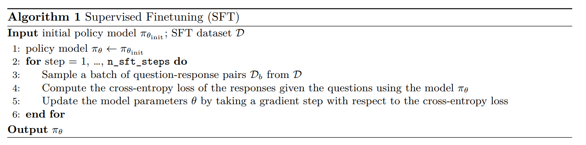

# CS336 Assignment 5 (alignment): Alignment and Reasoning RL

## 4 对 MATH 数据集的监督微调（Supervised Finetuning, SFT）
算法 1：监督微调（SFT）


**推理能力的监督微调** 在本节中，我们将在 MATH 数据集上对基础模型进行微调（见算法 1）。我们的目标不是让模型直接预测正确答案，而是先生成一段思维链（chain-of-thought）推理过程，再给出答案。为此，我们提供了一份由 DeepSeek R1（DeepSeek-AI 等人 [2025]）生成的此类推理轨迹数据集，路径为 `/data/a5-alignment/MATH/sft.jsonl`。

在实际训练推理模型时，SFT 通常被用作第二步强化学习微调的热启动。原因有二：
1. SFT 需要高质量的标注数据（即已有的推理轨迹），而 RL 只需正确答案作为反馈；
2. 即使在标注数据充足的情况下，RL 仍可通过探索找到比 SFT 数据更优的策略。

遗憾的是，我们使用的模型规模尚不足以在组合 SFT 与 RL 时展现出明显效果，因此本次作业中我们将这两个阶段分开处理。

### 4.1 使用 HuggingFace 模型
**加载 HuggingFace 模型和分词器**
要从本地目录加载 HuggingFace 模型和分词器（使用 bfloat16 精度并启用 FlashAttention-2 以节省显存），可使用以下示例代码：
```python
from transformers import AutoModelForCausalLM, AutoTokenizer

model = AutoModelForCausalLM.from_pretrained(
    "/data/a5-alignment/models/Qwen2.5-Math-1.5B",
    torch_dtype=torch.bfloat16,
    attn_implementation="flash_attention_2",
)
tokenizer = AutoTokenizer.from_pretrained("/data/a5-alignment/models/Qwen2.5-Math-1.5B")
```
**前向传播**
加载模型后，可在一批 input IDs 上执行前向传播，并通过输出的 `.logits` 属性获取 logits。然后，可计算模型预测 logits 与真实标签之间的损失：
```python
input_ids = train_batch["input_ids"].to(device)
labels = train_batch["labels"].to(device)
logits = model(input_ids).logits
loss = F.cross_entropy(...)
```
**保存训练后的模型**
训练完成后，可使用 `.save_pretrained()` 函数将模型保存到指定目录。由于模型体积较大，请务必保存至 `/data/yourusername` 下。建议同时保存分词器（即使未修改），以确保模型与分词器自包含、可从单一目录加载：
```python
# 保存模型权重
model.save_pretrained(save_directory=output_dir)
tokenizer.save_pretrained(save_directory=output_dir)
```
**梯度累积（Gradient Accumulation）**
尽管使用了 bfloat16 和 FlashAttention-2，即使在 80GB 显存的 GPU 上，也难以支持合理的批大小。为此，可采用梯度累积技术：不在每个 batch 后立即更新权重，而是累积多个 batch 的梯度后再执行一次优化器步。

直观理解：若 GPU 足够大，一次性计算 32 个样本的梯度，与分 16 次每次 2 个样本再平均，结果应一致。

在 PyTorch 中实现梯度累积很简单。通常流程为：
```python
for inputs, labels in data_loader:
    logits = model(inputs)
    loss = loss_fn(logits, labels)
    loss.backward()
    optimizer.step()
    optimizer.zero_grad()
```
要实现梯度累积，只需每隔 k 步（k 为累积步数）才调用 `optimizer.step()` 和 `optimizer.zero_grad()`。同时，在调用 `loss.backward()` 前，将损失除以 `gradient_accumulation_steps`，以实现梯度平均：
```python
gradient_accumulation_steps = 4
for idx, (inputs, labels) in enumerate(data_loader):
    logits = model(inputs)
    loss = loss_fn(logits, labels) / gradient_accumulation_steps
    loss.backward()
    if (idx + 1) % gradient_accumulation_steps == 0:
        optimizer.step()
        optimizer.zero_grad()
```
这样，实际训练时的有效批大小就扩大为原始批大小 × k。

### 4.2 SFT 辅助方法
接下来，将实现一些在 SFT 及后续 RL 实验中会用到的辅助方法。关于命名法的简要说明：在以下各节中，我们将交替使用 “output”, “completion”, or “response” 来指代模型在给定提示下的生成结果。

**提示与输出的分词（Tokenizing prompts and outputs）** 对于每个 question and target output $(q, o)$，我们将分别对问题和输出进行分词，然后拼接。这样，就可以用 SFT 模型（或后续的 RL 策略）对输出部分打分（计算对数概率）。此外，还需构建一个 `response_mask`：一个布尔掩码，对 all tokens in response为 True，对所有问题或填充（padding）token 为 False。该掩码将在训练循环中用于确保仅在 response tokens 上计算损失。

**问题（tokenize_prompt_and_output）：提示与输出的分词（2 分）**
交付物：实现一个 `tokenize_prompt_and_output` 方法，分别对问题和输出字符串进行分词、拼接，并构建 `response_mask`。推荐接口如下：
```python
def tokenize_prompt_and_output(prompt_strs, output_strs, tokenizer):
    """
    对提示和输出字符串进行分词，并构建一个掩码，标记响应 token（值为 1），其余（提示或填充）为 0。

    Args:
        prompt_strs: List[str] —— 提示字符串列表。
        output_strs: List[str] —— 输出字符串列表。
        tokenizer: PreTrainedTokenizer —— 用于分词的分词器。

    Returns:
        dict[str, torch.Tensor]：
            设 prompt_and_output_lens 为各拼接后序列的长度列表，
            返回字典包含以下键：
            - input_ids: shape (batch_size, max(prompt_and_output_lens) - 1)
                         拼接后的 token 序列（去掉最后一个 token）
            - labels: shape 同 input_ids，为 input_ids 右移一位（即去掉第一个 token）
            - response_mask: shape 同 input_ids，响应 token 对应位置为 True，其余为 False
    """
```
为测试你的代码，请实现 `[adapters.run_tokenize_prompt_and_output]`，然后运行以下命令确保测试通过：
```bash
uv run pytest -k test_tokenize_prompt_and_output
```
代码可见 [run_tokenize_prompt_and_output.py](run_tokenize_prompt_and_output.py)

**逐 token 熵记录** 在强化学习（RL）过程中，记录逐 token 熵通常很有用，可用于观察模型的预测分布是否变得（过度）自信。衡量模型在当前位置预测下一个 token 时，面对整个词表产生的不确定性（或随机性）。分布越平均，熵越大；预测越集中于某一个词，熵越小趋近于 0。现在我们将实现这一功能，并比较各种微调方法对模型预测熵的影响。

离散分布 $p(x)$（支撑集为 $\mathcal{X}$）的熵定义为：
$$H(p) = -\sum_{x \in \mathcal{X}} p(x)\log p(x).$$

给定 SFT 或 RL 模型的 logits，我们将计算每个 token 的熵，即每个下一个 token 预测的熵。

主要作用：
- 监控模型状态（防崩溃）：在训练（尤其是 RL）过程中，模型很容易陷入退化（Mode Collapse），只死记硬背一种输出，导致丧失泛化能力。此时计算出的熵会急剧下降，提醒我们模型失去了多样性。
- 促进探索（RL 正则化）：在基于策略梯度的 RL 算法中，通常会在损失函数里引入一个熵奖励（Entropy Bonus）。这会鼓励模型在拿高分的同时尽可能保持预测的多样性（保持一定的熵），使模型去探索不同的数学推理路径，防止其过早收敛到局部最优解。

**问题（compute_entropy）：Per-token entropy (1 point)**
交付要求
实现一个名为 `compute_entropy` 的方法，用于计算每个 token 的下一个 token 预测熵。建议采用以下接口：
```python
def compute_entropy(logits: torch.Tensor) -> torch.Tensor:
	功能：获取下一个 token 预测的熵（即在词汇表维度上的熵）。
	
	参数：
	- logits: torch.Tensor，形状为 (batch_size, sequence_length, vocab_size)，包含未归一化的 logits。
	
	返回值：
	- torch.Tensor，形状为 (batch_size, sequence_length)，表示每个下一个 token 预测的熵。
```
注意：你应该使用数值稳定的方法（例如，使用 `logsumexp`）以避免溢出。 为测试你的代码，请实现 `[adapters.run_compute_entropy]`，然后运行 `uv run pytest -k test_compute_entropy` 并确保你的实现通过测试。

代码可见 [run_compute_entropy.py](run_compute_entropy.py)

**从模型获取 log-probabilities** 从模型中获取对数概率是监督微调（SFT）和强化学习（RL）中都需要用到的基础操作。对于一个前缀 $x$，语言模型（LM）会输出下一个 token 的 logits $f_\theta(x) \in \mathbb{R}^{|V|}$，以及一个真实标签 $y \in V$。此时，$y$ 的对数概率为：
$$\log p_{\theta}(y \mid x) = \log\!\left[\operatorname{softmax}\!\big(f_{\theta}(x)\big)\right]_{y},$$

其中记号 $[x]_y$ 表示向量 $x$ 的第 $y$ 个元素。

主要作用：
- SFT（监督微调）的基础：在 SFT 阶段，训练不仅需要预测下一个词，还要衡量预测得“有多准”。交叉熵损失（Cross-Entropy Loss）的本质本质上就是负的条件对数概率。我们要最大化标准答案 token 的对数概率，让模型学会指定的推理解题步骤。
- RL（强化学习）策略更新的核心：在后续的 RL（如 GRPO/PPO）中，对数概率用于计算策略比率 (Policy Ratio)。当模型输出了一个带来高奖励（答对数学题）的序列时，RL 算法会通过对数概率来增加生成这些 token 的概率；反之则降低。

你应当使用一种数值稳定的方法来计算该值，并可自由使用 `torch.nn.functional` 中的方法。我们还建议增加一个可选参数，用于选择性地计算并返回每个 token 的熵。

**问题（get_response_log_probs）：响应对数概率（及熵）（2分）**
交付要求 实现 `get_response_log_probs` 方法，用于从因果语言模型中获取逐token条件对数概率（基于前文token），并可选返回模型下一个token分布的熵。推荐接口：
```python
def get_response_log_probs(
    model: PreTrainedModel,
    input_ids: torch.Tensor,
    labels: torch.Tensor,
    return_token_entropy: bool = False,
) -> dict[str, torch.Tensor]:
	"""参数：
    - model：PreTrainedModel，用于评分的HuggingFace模型（若无需计算梯度，需放置在正确设备上并处于推理模式）。
    - input_ids：torch.Tensor，形状为（batch_size, sequence_length），由分词方法生成的拼接后的提示词+响应token。
    - labels：torch.Tensor，形状为（batch_size, sequence_length），由分词方法生成的标签。
    - return_token_entropy：bool，若为True，通过调用`compute_entropy`额外返回逐token熵。

    返回值：
    - dict[str, torch.Tensor]：
    - "log_probs"：形状为（batch_size, sequence_length），条件对数概率\(log p_{\theta}(x_t | x_{<<t})\)。
    - "token_entropy"（可选）：形状为（batch_size, sequence_length），每个位置的逐token熵（仅当return_token_entropy=True时存在）。
    """
```
实现提示：通过 `model(input_ids).logits` 获取 logits。
测试方法：实现 `[adapters.run_get_response_log_probs]`，然后运行 `uv run pytest -k test_get_response_log_probs`，确保测试通过。

代码可见 [run_get_response_log_probs.py](run_get_response_log_probs.py)

**SFT microbatch train step**
SFT（监督微调）的微批次训练步骤中，我们最小化的损失是：在给定提示（prompt）的条件下，目标输出（target output）的负对数似然（negative log-likelihood）。
为了计算该损失，需要计算在给定提示条件下目标输出中每个 token 的对数概率，并对输出中所有 token 的对数概率求和，同时对提示部分的 token 和填充（padding）token 进行掩码（masking），使其不参与损失计算。

我们将实现一个辅助函数，该函数在后续强化学习（RL）过程中也会用到。

**问题（masked_normalize）：掩码归一化（1分）**
交付要求
实现 `masked_normalize` 方法，在考虑布尔掩码的前提下，对张量元素求和并通过常数进行归一化。
推荐接口
```python
def masked_normalize(
    tensor: torch.Tensor,
    mask: torch.Tensor,
    normalize_constant: float,
    dim: int | None = None,
) -> torch.Tensor:
"""
对指定维度求和并通过常数归一化，仅考虑掩码中值为1的元素。

参数：
- tensor：torch.Tensor，需求和并归一化的张量。
- mask：torch.Tensor，与tensor形状相同；值为1的位置会被纳入求和范围。
- normalize_constant：float，用于归一化的除数常数。
- dim：int | None，归一化前要求和的维度；若为None，对所有维度求和。

返回值：
- torch.Tensor，归一化后的和，其中掩码元素（mask == 0）不参与求和。
"""
```
测试方法：实现`[adapters.run_masked_normalize]`，然后运行 `uv run pytest -k test_masked_normalize`，确保测试通过。

代码可见 [run_masked_normalize.py](run_masked_normalize.py)

**监督微调（SFT）微批次训练步骤**
现在我们可以实现监督微调（SFT）的单个微批次训练步骤（需注意：若`gradient_accumulation_steps > 1`，则需对每个训练批次迭代多个微批次）。

**问题（sft_microbatch_train_step）：Microbatch train step (3 points)**
交付要求
实现监督微调（SFT）的单个微批次更新，包括交叉熵损失计算、掩码求和及梯度缩放。

推荐接口
```python
def sft_microbatch_train_step(
    policy_log_probs: torch.Tensor,
    response_mask: torch.Tensor,
    gradient_accumulation_steps: int,
    normalize_constant: float = 1.0,
) -> tuple[torch.Tensor, dict[str, torch.Tensor]]:
"""	
对微批次执行前向传播和反向传播。

参数：
- policy_log_probs：形状为（batch_size, sequence_length），来自待训练监督微调（SFT）策略的逐token对数概率。
- response_mask：形状为（batch_size, sequence_length），响应token对应位置为1，提示词/填充token对应位置为0。
- gradient_accumulation_steps：每个优化器步骤对应的微批次数量。
- normalize_constant：用于除法归一化的常数，默认设为1.0即可。

返回值：
- tuple[torch.Tensor, dict[str, torch.Tensor]]：
    - loss：标量张量，微批次损失（已根据梯度累积进行调整），返回该值用于日志记录。
    - metadata：字典，包含底层损失调用的元数据及其他需记录的统计信息。
"""
```
实现提示 需在该函数中调用 `loss.backward()`，确保根据梯度累积进行调整。
测试方法：实现 `[adapters.run_sft_microbatch_train_step]`，然后运行 `uv run pytest -k test_sft_microbatch_train_step`，确保测试通过。

代码可见 [run_sft_microbatch_train_step.py](run_sft_microbatch_train_step.py)

**Logging generations in-the-loop**
在模型训练循环中记录生成结果是良好的实践，监督微调（SFT）/ 强化学习（RL）场景也不例外。编写 `log_generations` 函数，用于让模型对给定提示词（如从验证集中采样的提示词）生成响应并记录日志。建议为每个示例至少记录以下内容：
1. 输入提示词。
2. 监督微调（SFT）/强化学习（RL）模型生成的响应。
3. 真实答案。
4. 奖励信息，包括格式、答案及总奖励。
5. 响应的平均token熵。
6. 平均响应长度、正确响应的平均长度及错误响应的平均长度。

问题（log_generations）：生成结果日志记录（1分）
交付要求
实现 `log_generations` 函数，用于记录模型的生成结果。

### 4.3 SFT Experiment
利用上述模块，现在将实现完整的监督微调（SFT）流程（算法1），在MATH数据集上微调 Qwen 2.5 Math 1.5B Base 模型。`/data/a5-alignment/MATH/sft.jsonl` 中的每个示例包含 formatted prompt 和 target response，其中 target response 包括思维链推理过程和最终答案。具体而言，每个示例是一个 JSON 元素，格式为`{"prompt": str, "response": str}`。

为跟踪模型在训练过程中的进度，需定期在 MATH 验证集上评估模型。运行脚本时需使用 2 块 GPU：一块用于策略模型，另一块用于 vLLM 实例以评估策略。以下是初始化 vLLM 并在每次 rollout 阶段前将策略权重加载到 vLLM 实例的 starter 代码：
```python
from vllm.model_executor import set_random_seed as vllm_set_random_seed
from unittest.mock import patch
from vllm import LLM
from transformers import PreTrainedModel

def init_vllm(model_id: str, device: str, seed: int, gpu_memory_utilization: float = 0.85):
    """
    启动推理过程，此处使用vLLM将模型部署在与策略模型不同的GPU上。
    """
    vllm_set_random_seed(seed)
    # 从TRL借鉴的Monkeypatch：https://github.com/huggingface/trl/blob/
    # 22759c820867c8659d00082ba8cf004e963873c1/trl/trainer/grpo_trainer.py
    # 对vLLM进行补丁，确保：
    # （1）将vLLM模型部署到指定设备（world_size_patch）；
    # （2）跳过不适合当前场景的测试（profiling_patch）。
    world_size_patch = patch("torch.distributed.get_world_size", return_value=1)
    profiling_patch = patch(
        "vllm.worker.worker.Worker._assert_memory_footprint_increased_during_profiling",
        return_value=None
    )
    with world_size_patch, profiling_patch:
        return LLM(
            model=model_id,
            device=device,
            dtype=torch.bfloat16,
            enable_prefix_caching=True,
            gpu_memory_utilization=gpu_memory_utilization,
        )

def load_policy_into_vllm_instance(policy: PreTrainedModel, llm: LLM):
    """
    从https://github.com/huggingface/trl/blob/
    22759c820867c8659d00082ba8cf004e963873c1/trl/trainer/grpo_trainer.py#L670复制
    """
    state_dict = policy.state_dict()
    llm_model = llm.llm_engine.model_executor.driver_worker.model_runner.model
    llm_model.load_weights(state_dict.items())
```
建议同时记录训练步骤和验证步骤的指标（这在后续强化学习（RL）实验中也会用到）。在 wandb 中可通过以下代码实现
```python
# 配置wandb指标
wandb.define_metric("train_step")  # 训练过程的x轴
wandb.define_metric("eval_step")  # 评估过程的x轴
# 所有以train/开头的指标都与train_step绑定
wandb.define_metric("train/*", step_metric="train_step")
# 所有以eval/开头的指标都与eval_step绑定
wandb.define_metric("eval/*", step_metric="eval_step")
```
最后，建议使用梯度裁剪，裁剪值设为1.0。

**问题（sft_experiment）：在MATH数据集上运行监督微调（SFT）（2分）（2个H100小时）**
1. 使用 Qwen 2.5 Math 1.5B 基础模型，在推理型监督微调（SFT）示例（路径：`/data/a5-alignment/MATH/sft.jsonl`）上运行监督微调（SFT），监督微调（SFT）的唯一示例数量在{128, 256, 512, 1024}范围内变化，同时也使用完整数据集。调整学习率和批次大小，确保使用完整数据集时验证准确率至少达到15%。
交付要求：不同数据集大小对应的验证准确率曲线。
2. 过滤推理型监督微调（SFT）示例，仅保留能产生正确答案的示例。在（完整的）过滤后数据集上运行监督微调（SFT），报告过滤后数据集的大小及达到的验证准确率。
交付要求：报告数据集大小及验证准确率曲线，并与之前的监督微调（SFT）实验结果进行对比。
