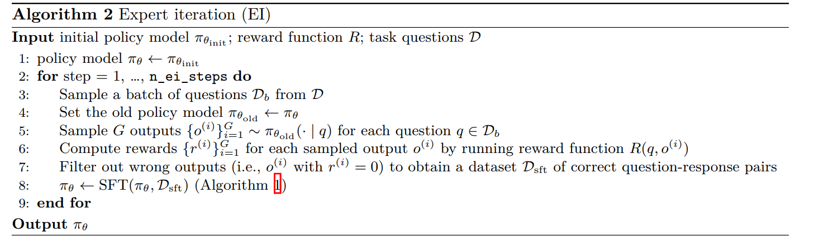

# CS336 Assignment 5 (alignment): Alignment and Reasoning RL

## 5 MATH 数据集的专家迭代
在上一节中，我们发现通过从监督微调（SFT）数据中过滤掉不良示例，可以提升监督微调（SFT）模型的性能。本节将进一步优化：将该过滤流程应用于基础模型自身生成的推理轨迹。这一过程在文献中被称为专家迭代（expert iteration）[Anthony et al., 2017]，在语言模型领域，Cobbe et al. [2021b]、Zelikman et al. [2022]、Dohan et al. [2022]、Gulcehre et al. [2023] 等学者已对此进行了探索。



接下来，我们将在 MATH 数据集上运行专家迭代。
小提示, 需为 vLLM 的 SamplingParams 传入 min_tokens 参数，确保不会生成空字符串（否则可能导致后续实现中出现 NaN 值）。具体设置如下：
```python
sampling_min_tokens = 4
sampling_params = SamplingParams(
    temperature=sampling_temperature,
    max_tokens=sampling_max_tokens,
    min_tokens=sampling_min_tokens,
    n=G,  # 问题回复数量
    seed=seed,
)
```
与监督微调（SFT）相同，需使用梯度裁剪，裁剪值设为1.0。

**问题（expert_iteration_experiment）：在MATH数据集上运行专家迭代（2分）（6个H100小时）**
在 MATH 数据集（路径为 `/data/a5-alignment/MATH/train.jsonl`）上，使用 Qwen 2.5 Math 1.5B Base 模型运行专家迭代（Expert Iteration），设置专家迭代步数 $n_{ei\_steps} = 5$。
实验中需调整以下超参数：
- 每个问题的 rollout 数量 (G)；
- 监督微调（SFT）步骤中使用的训练轮数（epochs）；
- 每次专家迭代步骤中的 batch_size（即 $D_b$ 的大小），在 {512, 1024, 2048} 中选择。
  
无需尝试所有超参数组合，只需进行足够多的实验以对每个超参数的影响得出合理结论即可。在训练过程中，请记录模型生成回答 response 的熵（entropy）变化情况。此外，请确保使用 vLLM 进行推理时，在遇到第二个答案标签 `</answer>` 时终止生成，这一处理方式应与监督微调（SFT）部分保持一致。

交付成果
1. 不同滚动配置对应的验证准确率曲线。至少尝试2种不同的滚动次数和轮数。
2. 在MATH数据集上验证准确率至少达到15%的模型。
3. 简要的两句话讨论：对比SFT的性能，以及不同EI（专家迭代）步骤下的性能。
4. 训练过程中模型响应熵值的图表。

使用正确 prompt-response 对微调后模型的准确率增长，正确 prompt-response 对的数量也增加，使模型准确率进一步增长。随着模型准确率的提升，response 的熵逐步减小。

