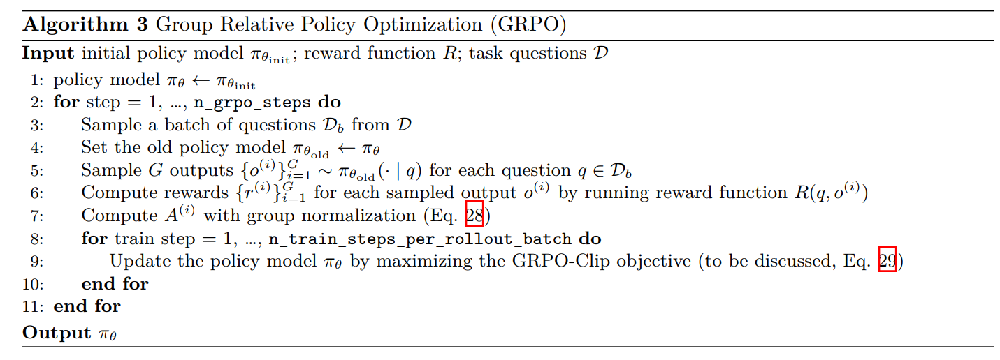
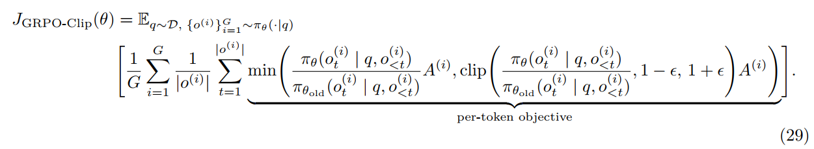

# CS336 Assignment 5 (alignment): Alignment and Reasoning RL

## 7 Group Relative Policy Optimization
下文将介绍“组相对策略优化（GRPO）”——这是一种策略梯度变体，你将基于该方法实现并实验数学问题求解。

### 7.1 GRPO 算法
**优势值估计（Advantage Estimation）**
GRPO 的核心思想是：对每个问题，从策略 $\pi_{\theta}$ 中采样多个输出，并用这些输出计算基线。这种方式的优势在于：无需学习神经网络价值函数 $V_{\phi}(s)$ （该函数训练难度大，且从系统实现角度看较为繁琐）。传统方法里，通常需要训练一个额外的全尺寸神经网络（如 Critic/Value 模型）来专门预测基线，这非常耗时耗力。

为了省去专门训练一个预测网络，GRPO 采用了“组内对比”的方法来计算基线和优势值，通过让模型对同一问题回答多次并计算均值，巧妙地获得了一个评判标准（基线），从而计算出每一次回答的相对好坏（优势值），以此来更新模型。面对同一个数学题，它让当前模型一口气生成 $G$ 个答案，分别算出它们的真实得分 $r^{(1)}, r^{(2)}, \dots, r^{(G)}$。对于问题 $q$ 和从策略中采样的 $G$ 个输出 $\{o^{(i)}\}_{i=1}^G \sim \pi_{\theta}(\cdot | q)$，设 $r^{(i)} = R\left(q, o^{(i)}\right)$ 为第 $i$ 个输出的奖励。DeepSeekMath [Shao 等, 2024] 和 DeepSeek R1 [DeepSeek-AI 等, 2025] 中，第 $i$ 个输出的“组归一化奖励”（即优势值）定义为：
$$A^{(i)} = \frac{r^{(i)} - \text{mean}\left(r^{(1)}, r^{(2)}, \dots, r^{(G)}\right)}{\text{std}\left(r^{(1)}, r^{(2)}, \dots, r^{(G)}\right) + \text{advantage\_eps}}, \tag{28}$$

分子$r^{(i)} - \text{mean}\left(r^{(1)}, r^{(2)}, \dots, r^{(G)}\right)$ 计算第 $i$ 个答案比平均分高了多少（或低了多少），这就是最基础的优势值。如果是正数，接下来就会鼓励模型多生成这种答案；如果是负数，就会惩罚。分母 $\text{std}(\dots)$表示这 $G$ 个答案得分的标准差。除以标准差是为了做数据归一化（防止得分差距过大导致梯度爆炸），让优势值稳定在一个合理的区间内。advantage_eps 为防止分母为 0 的小常数。注意：该优势值 $A^{(i)}$ 对响应中的每个 token 都相同，即$A_t^{(i)} = A^{(i)}, \forall t \in \{1, ..., |o^{(i)}|\}$，因此下文将省略下标 $t$。在数学解题这类任务中，模型通常是在生成完所有的中间推理和最终答案后，才会获得一次整体的奖励（对或错）。因为系统无法自动将这个最终奖励精确分配给中间的某一个特定词，所以算法选择将评估整个回答算出的总优势值 $A^{(i)}$，无差别地赋予该回答中的每一步（每一个 token）。

**高层算法流程（High-level algorithm）**
在深入 GRPO 目标函数之前，先通过 Shao 等 [2024] 提出的算法 3，了解 GRPO 的训练循环框架。注 ：这是 DeepSeekMath 中 GRPO 的特例——使用经过验证的奖励函数，无 KL 散度项，也没有对参考模型和奖励模型进行迭代更新。

**GRPO 目标函数 （GRPO objective）**
GRPO 目标函数融合了三项核心思想：
1. 异策略策略梯度（见式 27）；
2. 通过组归一化计算优势值$A^{(i)}$（见式 28）；
3. 裁剪机制（Clipping Mechanism），源自近邻策略优化（PPO, Schulman 等 [2017]）。

裁剪机制的目的是：在同一批轨迹上执行多步梯度更新时，保证训练稳定性。它的工作原理是防止当前策略 $\pi_{\theta}$ 偏离旧策略太远。



首先，我们给出完整的 GRPO-Clip 目标函数，再解释裁剪操作的作用：


超参数 $\epsilon>0$ 用于控制策略的更新幅度。为更直观理解，我们参考 Achiam [2018a,b]的方法重写逐 token 目标函数。定义函数：
$$
g\left(\epsilon, A^{(i)}\right)=
\begin{cases}
(1+\epsilon)A^{(i)}, & \text{if } A^{(i)}\ge 0,\\
(1-\epsilon)A^{(i)}, & \text{if } A^{(i)}< 0.
\end{cases} \tag{30}
$$

则逐 token 目标函数可重写为：
$$
\text{per-token objective}=
\min\!\left(
\frac{\pi_{\theta}\!\big(o^{(i)}_{t}\mid q, o^{(i)}_{<t}\big)}
     {\pi_{\theta_{\mathrm{old}}}\!\big(o^{(i)}_{t}\mid q, o^{(i)}_{<t}\big)}A^{(i)},
\;
g\left(\epsilon, A^{(i)}\right)
\right).
$$

我们分情况讨论：
- 当优势值 $A(i)$ 为正时，逐 token 目标函数简化为：
$$
\text{per-token objective}=\min\!\left(
\frac{\pi_{\theta}\!\big(o^{(i)}_{t}\mid q, o^{(i)}_{<t}\big)}
     {\pi_{\theta_{\mathrm{old}}}\!\big(o^{(i)}_{t}\mid q, o^{(i)}_{<t}\big)},
\,1+\epsilon
\right)A^{(i)}.
$$
由于 $A^{(i)}>0$，若动作 $o_{t}^{(i)}$ 在 $\pi_{\theta}$ 下的概率增大（即 ${\pi_{\theta}\left(o_{t}^{(i)} | q, o_{<t}^{(i)}\right)}$)的值变大），目标函数值会增加。min 函数的裁剪作用限制了目标函数的增长幅度：当 ${\pi_{\theta}\left(o_{t}^{(i)} | q, o_{<t}^{(i)}\right)} > (1+\epsilon){\pi_{\theta_{old}}\left(o_{t}^{(i)} | q, o_{<t}^{(i)}\right)}$) 时，逐 token 目标函数达到最大值 $(1+\epsilon)A(i)$，从而避免策略 $\pi_\theta$ 与旧策略 $\pi_{\theta_{old}}$ 偏差过大。

- 当优势值 $A(i)$ 为负时，模型会尝试降低 ${\pi_{\theta}\left(o_{t}^{(i)} | q, o_{<t}^{(i)}\right)}$ 的概率，但裁剪机制会阻止其降至 $(1-\epsilon){\pi_{\theta_{old }}\left(o_{t}^{(i)} | q, o_{<t}^{(i)}\right)}$ 以下（完整推导参见Achiam [2018b]）。

### 7.2 Implementation
在理解 GRPO 的训练流程和目标函数后，我们开始分模块实现。SFT 和 EI 部分的许多模块可直接复用。

**计算优势值（组归一化奖励）Computing advantages (group-normalized rewards)**
首先实现 a rollout batch 中每个样本的优势值计算逻辑，即组归一化奖励。我们考虑两种组归一化方式：1. 前文公式 28 的标准方法. 2. 近期提出的简化方法。
Dr. GRPO [Liu et al., 2025] 指出，通过 $std(r(1), r(2), \dots, r(G))$ 进行归一化的方式，会奖励答案正确性波动较小的问题，而这可能并不理想。因此，他们提出移除标准差归一化步骤，直接计算：
$$A^{(i)} = r^{(i)} - \text{mean}\left(r^{(1)}, r^{(2)}, ..., r^{(G)}\right) \tag{31}$$

我们将实现两种变体，并在后续实验中对比其性能。

**问题（compute_group_normalized_rewards）：组归一化（2分）**
交付要求：实现 `compute_group_normalized_rewards` 方法，计算每个滚动响应的原始奖励，在组内进行归一化，并返回归一化奖励、原始奖励及有用的元数据。
推荐接口：
```python
def compute_group_normalized_rewards(
    reward_fn: Callable[[str, str], dict[str, float]],
    rollout_responses,
    repeated_ground_truths,
    group_size,
    advantage_eps,
    normalize_by_std,
):
    """为每组 rollout 响应计算奖励，并按组进行归一化。

    参数：
    reward_fn: Callable[[str, str], dict[str, float]]  
        用于将 rollout 响应与标准答案（ground truth）进行比较并打分的函数，返回一个字典，
        包含键 "reward"、"format_reward" 和 "answer_reward"。
    
    rollout_responses: list[str]  
        策略生成的 rollout 响应列表。该列表长度为 rollout_batch_size，
        即 rollout_batch_size = n_prompts_per_rollout_batch * group_size。
    
    repeated_ground_truths: list[str]  
        每个样本对应的标准答案列表。该列表长度也为 rollout_batch_size，
        因为每个问题的标准答案被重复了 group_size 次（与每个问题对应的多个响应对齐）。
    
    group_size: int  
        每个问题（即每组）生成的响应数量。
    
    advantage_eps: float  
        用于归一化时避免除零的小常数。
    
    normalize_by_std: bool  
        若为 True，则用每组奖励的标准差进行归一化（即减去均值后除以标准差）；
        否则仅减去组内均值。

    返回：
    tuple[torch.Tensor, torch.Tensor, dict[str, float]]
        - advantages: shape (rollout_batch_size,)，每条 rollout 响应的组内归一化奖励（即优势值）。
        - raw_rewards: shape (rollout_batch_size,)，每条 rollout 响应的原始未归一化奖励。
        - metadata: 用户自定义的其他统计信息，可用于日志记录（例如奖励的均值、标准差、最大/最小值等）。
    """
```
测试方法：实现 `[adapters.run_compute_group_normalized_rewards]`，运行命令 `uv run pytest -k test_compute_group_normalized_rewards` 并确保测试通过。

代码可见 [run_compute_group_normalized_rewards.py](run_compute_group_normalized_rewards.py)

**朴素策略梯度损失**
接下来实现损失计算相关方法。需注意：这些并非传统意义上的损失函数，不应作为评估指标。在强化学习中，应跟踪训练集和验证集的回报值等指标（详见6.5节讨论）。

首先实现朴素策略梯度损失，该损失直接将优势值与动作的对数概率相乘并取负。对于问题 q、响应 o 和响应 token $o_t$，逐 token 朴素策略梯度损失为：
$$-A_{t} \cdot \log p_{\theta}\left(o_{t} | q, o_{<t}\right) \tag{32}$$

**问题（compute_naive_policy_gradient_loss）：朴素策略梯度（1分）**
交付要求：实现 `compute_naive_policy_gradient_loss` 方法，使用原始奖励或预计算的优势值计算逐 token 策略梯度损失。
推荐接口：
```python
def compute_naive_policy_gradient_loss(
    raw_rewards_or_advantages: torch.Tensor,
    policy_log_probs: torch.Tensor,
) -> torch.Tensor:
    """
    计算每个token的策略梯度损失，其中raw_rewards_or_advantages可为原始奖励或已归一化的优势值
    
    参数：
        raw_rewards_or_advantages: 形状为(batch_size, 1)的张量，每个滚动响应的标量奖励/优势值
        policy_log_probs: 形状为(batch_size, sequence_length)的张量，每个token的对数概率
    
    返回：
        形状为(batch_size, sequence_length)的张量，逐token策略梯度损失（将在训练循环中跨批次和序列维度聚合）
    """
```
实现提示：
- 将 raw_rewards_or_advantages 在 sequence_length 维度上广播（broadcast）

测试方法：实现 `[adapters.run_compute_naive_policy_gradient_loss]`，运行命令 `uv run pytest -k test_compute_naive_policy_gradient_loss` 并确保测试通过。

代码可见 [run_compute_naive_policy_gradient_loss.py](run_compute_naive_policy_gradient_loss.py)

