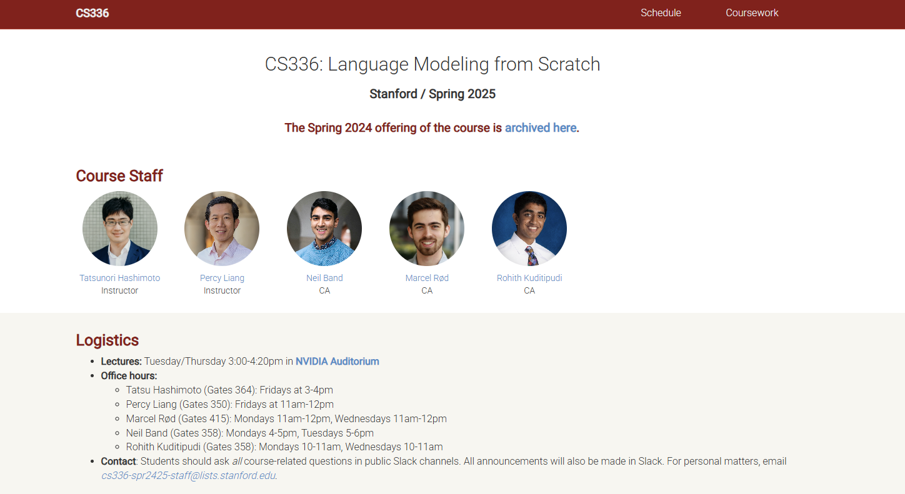

# CS336-StudyNotes-and-Homework

Stanford **CS336: Language Models from Scratch** 是一门强调“从零构建大语言模型”的实践型课程，系统覆盖大模型的完整链路：从 **Transformer 语言模型的核心组件与训练目标** 出发，进一步深入 **训练系统与性能优化（profiling、算子优化、分布式与内存效率）**，再到 **规模化规律与扩展（scaling law、模型规模增长）**、**预训练数据处理（清洗、过滤、去重）**，以及最终的 **对齐方法（指令微调与 RLHF）**。课程兼顾原理与工程实现，帮助学习者理解 LLM 如何工作、如何高效训练并在真实场景中落地。

这个仓库记录了我在 Stanford CS336 课程中的个人学习笔记和已完成的作业。

**⭐ 如果这个项目对你有帮助，请您给我点一个 Star⭐**

## [📖 课程官网](https://stanford-cs336.github.io/spring2025/)

---

## 💻 课程学习笔记和作业
本项目主要集中在对作业内容进行归纳整理，我将在这里展示自己的作业思考和学习笔记。

| 作业编号 | 主题 | 描述 | 状态 |
|:---:|:---:|:---:|:---:|
| **[Assignment1](Assignment1)** | Basics | 实现分词器/模型/优化器，训练一个最小语言模型 | ✅ 已完成 |
| **Assignment2** | Systems | 做性能分析与优化（RMSNorm GPU kernel），并支持分布式/省显存训练 | 待更新 |
| **Assignment3** | Scaling | 拟合 scaling law，用于分析模型规模增长 | 待更新 |
| **Assignment4** | Data | 处理 Common Crawl，做清洗、过滤、去重 | 待更新 |
| **Assignment5** | Alignment | 准备指令数据并做 RLHF，让模型更“听话” | 待更新 |

